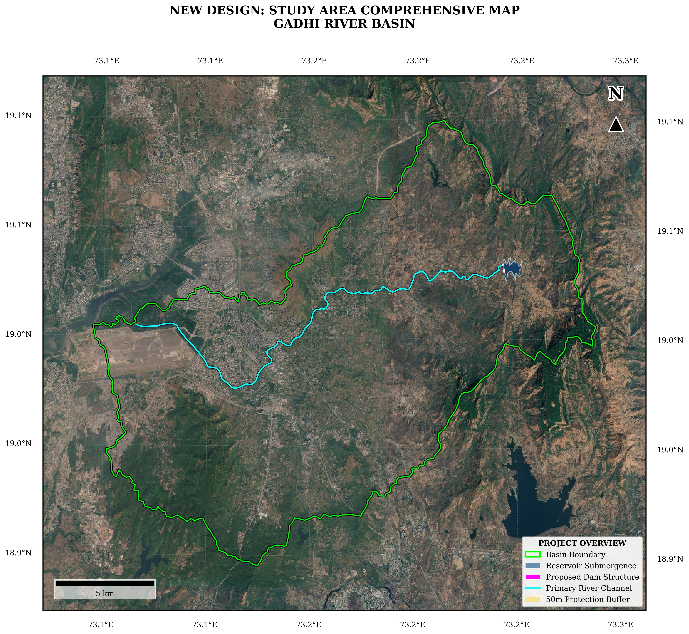
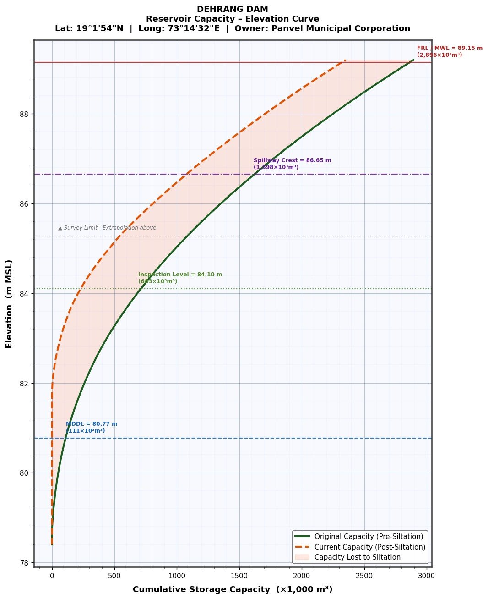

# Description of the Dam / Reservoir System

Dehrang Dam is an earthen embankment structure with a gated spillway,
built across the Gadhi River in 1957. The dam is situated in the Western
Ghats foothills of the Raigad district and has been the primary water
supply source for the Panvel Municipal Corporation for over six decades.
The most recent pre-monsoon inspection was conducted by Yash Engineering
Consultant Pvt. Ltd. in April 2025. The salient features of the dam are
summarised in Table 1 below.

*Table 1: Salient Features of Dehrang Dam*

| **Sr. No.** | **Parameter**                           | **Value**                             |
|-------------|-----------------------------------------|---------------------------------------|
| 1           | **Name of Project**                     | Dehrang                               |
| 2           | **Name of Dam**                         | Dehrang Dam                           |
| 3           | **Owner**                               | Panvel Municipal Corporation          |
| 4           | **Nearest City**                        | Panvel                                |
| 5           | **River / Nalla**                       | Gadhi River                           |
| 6           | **Latitude**                            | 19 deg 01' 54" N                      |
| 7           | **Longitude**                           | 73 deg 14' 32" E                      |
| 8           | **Year of Construction**                | 1957                                  |
| 9           | **Type of Dam**                         | Earthen Dam with Gated Spillway       |
| 10          | **Top Bund Level (TBL)**                | 91.65 m MSL                           |
| 11          | **Full Reservoir Level / MWL (FRL)**    | 89.15 m MSL                           |
| 12          | **MDDL**                                | 80.77 m MSL                           |
| 13          | **Spillway Crest Level (Gate Sill)**    | 86.65 m MSL                           |
| 14          | **Lowest Riverbed Level (RBL)**         | 81.4 m MSL                            |
| 15          | **Design Flood Lift for Spillway**      | 2.50 m                                |
| 16          | **Total Dam Length**                    | 335 m                                 |
| 17          | **Dam Width at Top**                    | 3.00 m (Revised: 3.30 m)              |
| 18          | **Berm Level (Revised)**                | 82.50 m MSL                           |
| 19          | **Berm Width (Revised)**                | 6.50 m                                |
| 20          | **Total Gate Length**                   | 111 m (11 Nos., 8.70 m x 2.50 m each) |
| 21          | **Type of Gate**                        | Godbole Type Automatic Tilting Gate   |
| 22          | **Catchment Area**                      | 27.00 km2                             |
| 23          | **Original Storage Capacity**           | 11.01 MCum (Pre-siltation)            |
| 24          | **Revised Capacity (Post Gate Fixing)** | 3.507 MCum                            |
| 25          | **Present Capacity (Post Siltation)**   | 2.70 MCum (approx.)                   |
| 26          | **Gross Storage at FRL (2025 Survey)**  | 2,351.58 x 10^3 m3 (2.352 MCM)        |
| 27          | **Average Annual Rainfall**             | 2,000 mm                              |
| 28          | **Maximum Annual Rainfall**             | 4,417 mm                              |
| 29          | **Distance from Panvel**                | 18 km                                 |

The gated spillway comprises 11 Godbole-type Automatic Tilting Gates,
each 8.70 m wide and 2.50 m deep, providing a total controlled spillway
length of 111 m. The gate sill level is 86.65 m MSL, providing a maximum
water depth above the crest of 2.50 m at FRL (89.15 m MSL).

The reservoir has experienced significant siltation over its operational
life. The original design capacity was 11.01 MCum; a detailed sludge
survey in April 2025 confirmed the present gross storage at FRL to be
2,351.58 x 10^3 m3 (2.352 MCM), representing an 18.8% reduction from the
pre-siltation capacity. The complete Elevation-Area-Capacity table is
provided in Annexure I.

Figure 1.1: Study Area Comprehensive Map – Gadhi River Basin showing
Basin Boundary, Reservoir, Primary River Channel and Downstream Flood
Plain

# Annexure I - Reservoir Elevation-Area-Capacity Table

Figure A1: Dehrang Dam – Reservoir Elevation-Area-Capacity Curve (Pre-
and Post-Siltation)

The Elevation-Area-Capacity (EAC) relationship for Dehrang Reservoir was
derived from a detailed pre-monsoon sludge survey conducted in April
2025 by Yash Engineering Consultant Pvt. Ltd. using a systematic 10 m x
10 m grid-based bathymetric survey method (box method). Siltation
volumes were quantified by comparing the 2025 survey against the
pre-siltation EAC curve from the original dam design records. Volumes
were computed using the Trapezoidal Integration (prismoidal) method
between successive elevation contours.

The survey confirms a total siltation volume of 544.14 x 10^3 m3
accumulated primarily below the spillway gate sill level (86.65 m MSL),
with the top of silt layer identified at approximately El. 85.40 m MSL.
The gross storage at FRL (89.15 m MSL) is 2,351.58 x 10^3 m3 (2.352
MCM), representing an 18.8% reduction from the original design capacity
and a significant reduction from the post-gate-installation revised
capacity of 3.507 MCum. The complete EAC table is presented below; this
data was entered directly into the HEC-RAS Storage Area element for
reservoir drawdown simulation.

| **Sl.**   | **Elev. (m MSL)** | **Orig. Area (ha)** | **Incr. Vol. (10^3 m3)** | **Cum. Orig. (10^3 m3)** | **Curr. Area (ha)** | **Incr. Vol. (10^3 m3)** | **Cum. Curr. (10^3 m3)** | **Silt Vol. (10^3 m3)** | **Silt %** | **Key Level**      |
|-----------|-------------------|---------------------|--------------------------|--------------------------|---------------------|--------------------------|--------------------------|-------------------------|------------|--------------------|
| 78.40     | 0                 | 0                   | 0                        | 0                        | 0                   | 0                        | 0                        | 0                       | 100        |                    |
| 79.00     | 2.68              | 4.28                | 5.98                     | 0                        | 0                   | 0                        | 5.98                     | 2.68                    | 100        |                    |
| 80.00     | 6.11              | 11.43               | 49.91                    | 0                        | 0                   | 0                        | 49.91                    | 6.11                    | 100        | MDDL approx.       |
| 81.00     | 10.61             | 19.97               | 131.25                   | 0                        | 0                   | 0                        | 131.25                   | 10.61                   | 100        |                    |
| 82.00     | 15.18             | 29.37               | 259.80                   | 2.55                     | 3.05                | 3.60                     | 256.20                   | 12.63                   | 98.6       |                    |
| 83.00     | 21.36             | 41.07               | 439.17                   | 9.72                     | 18.33               | 67.64                    | 371.52                   | 11.65                   | 84.6       |                    |
| 84.00     | 27.58             | 53.40               | 683.36                   | 19.54                    | 36.81               | 208.85                   | 474.51                   | 8.04                    | 69.4       |                    |
| 85.00     | 33.44             | 65.70               | 988.90                   | 29.45                    | 58.77               | 459.03                   | 529.87                   | 3.99                    | 53.6       |                    |
| 85.40     | 35.77             | 70.38               | 1127.33                  | 35.77                    | 65.24               | 583.19                   | 544.14                   | 0                       | 48.3       | Silt top           |
| 86.00     | 39.25             | 77.34               | 1352.41                  | 39.25                    | 77.34               | 808.27                   | 544.14                   | 0                       | 40.2       |                    |
| **86.65** | **--**            | **--**              | **1588**                 | **--**                   | **--**              | **1044**                 | **544.14**               | **0**                   | **34.3**   | **Spillway Crest** |
| 87.00     | 44.93             | 88.73               | 1773.39                  | 44.93                    | 88.73               | 1229.25                  | 544.14                   | 0                       | 30.7       |                    |
| 88.00     | 50.49             | 99.88               | 2250.60                  | 50.49                    | 99.88               | 1706.46                  | 544.14                   | 0                       | 24.2       |                    |
| 89.00     | 55.93             | 110.78              | 2782.79                  | 55.93                    | 110.78              | 2238.65                  | 544.14                   | 0                       | 19.6       |                    |
| **89.15** | **57.00**         | **112.93**          | **2895.72**              | **57.00**                | **112.93**          | **2351.58**              | **544.14**               | **0**                   | **18.8**   | **FRL**            |

*Annexure I: Dehrang Reservoir Elevation-Area-Capacity Table (2025
Pre-Monsoon Survey)*

***Note:** Key elevations: FRL/MWL = 89.15 m MSL (gross storage 2,351.58
x10^3 m3). Spillway Gate Sill = 86.65 m MSL. MDDL = 80.77 m MSL
(approx.). RBL = 75.40 m MSL. Top of silt layer = 85.40 m MSL. Total
siltation volume = 544.14 x 10^3 m3 (18.8% of FRL capacity). Data
source: Yash Engineering Consultant Pvt. Ltd., April 2025*

*.*
