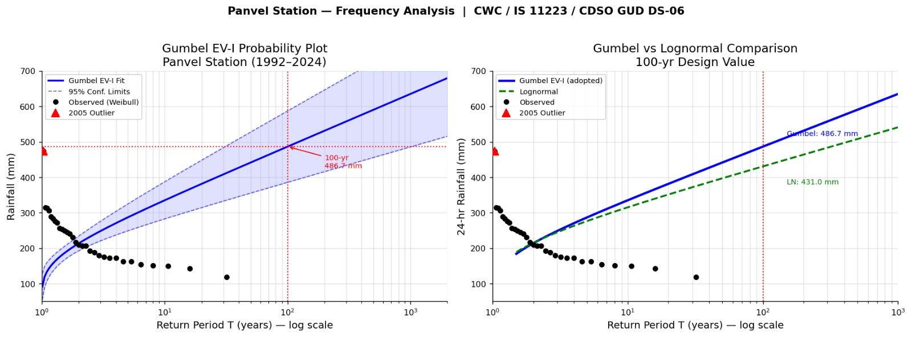
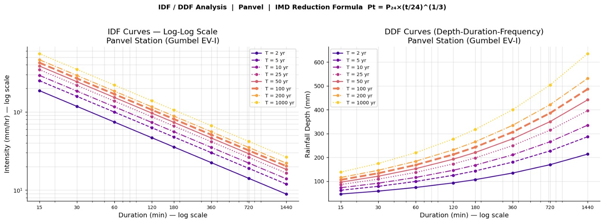

# IDF Analysis and Design Storm

## 3.1 Rainfall Data and Station Details

Annual maximum daily rainfall data spanning 31 years (1992-2024) was
obtained from the India Meteorological Department (IMD) for the Panvel
raingauge station \[Station ID: 102187319\], located at 18.9833 deg N,
73.1167 deg E. Two years (1997 and 2006) have missing data and are
excluded, resulting in N = 31 observations. The series ranges from 118.6
mm (1995) to 473.5 mm (2005). Descriptive statistics: mean = 225.06 mm,
S = 71.84 mm, Cv = 0.319, Cs = 1.357.

## 3.2 Frequency Analysis - Gumbel EV-I and Lognormal



*Figure 3.1: Gumbel EV-I Probability Plot and Lognormal Comparison –
Panvel Station (1992–2024); 100-yr design rainfall = 486.7 mm*

Frequency analysis was performed using Gumbel EV-I and Lognormal
distributions as recommended by the CWC Manual on Flood Estimation
(1989) and IS 11223. The Gumbel EV-I design rainfall uses the Chow
formula XT = x-bar + K\*S, where K = (yT - yn)/Sn; yn = 0.5370 and Sn =
1.1156 for N = 31. Both distributions pass Kolmogorov-Smirnov (Dcrit =
0.2443) and Chi-square goodness-of-fit tests at the 5% significance
level.

*Table 2: Statistical Parameters and Goodness-of-Fit Test Summary*

| **Parameter**                     | **Value**                                                 |
|-----------------------------------|-----------------------------------------------------------|
| **N (Record Length)**             | 31 years (1992-2024)                                      |
| **Missing Years**                 | 1997 and 2006                                             |
| **Sample Mean (x-bar)**           | 225.06 mm                                                 |
| **Sample Std Dev (S)**            | 71.84 mm                                                  |
| **Coefficient of Variation (Cv)** | 0.319                                                     |
| **Skewness Coefficient (Cs)**     | 1.357                                                     |
| **Gumbel yn (N=31)**              | 0.5370                                                    |
| **Gumbel Sn (N=31)**              | 1.1156                                                    |
| **Lognormal uY**                  | 5.3720                                                    |
| **Lognormal sY**                  | 0.2983                                                    |
| **K-S Test - Gumbel EV-I**        | PASS (D=0.0722 \< Dcrit=0.2443)                           |
| **K-S Test - Lognormal**          | PASS (D=0.0695 \< Dcrit=0.2443)                           |
| **Chi-Square Test (Gumbel)**      | PASS (Chi2=0.129 \< 5.991)                                |
| **2005 Outlier Status**           | CONFIRMED (G=3.46 \> Gcrit=2.93; retained conservatively) |


*Table 3: Design Rainfall Comparison - Gumbel EV-I vs Lognormal (All

| **Return Period T (yr)** | **Gumbel EV-I XT (mm)** | **95% CL Lower (mm)** | **95% CL Upper (mm)** | **Lognormal XT (mm)** |
|--------------------------|-------------------------|-----------------------|-----------------------|-----------------------|
| 2                        | 214.08                  | 193.16                | 235.00                | 215.29                |
| 5                        | 287.07                  | 249.12                | 325.03                | 276.73                |
| 10                       | 335.40                  | 282.99                | 387.81                | 315.55                |
| 25                       | 396.46                  | 324.84                | 468.07                | 362.95                |
| 50                       | 441.76                  | 355.60                | 527.92                | 397.29                |
| **100**                  | **486.72**              | 386.00                | 587.45                | 430.95                |
| 200                      | 531.52                  | 416.20                | 646.84                | 464.25                |
| 1000                     | 635.29                  | 486.00                | 784.59                | 541.25                |

Return Periods)*

## 3.3 100-Year Design Rainfall

The 100-year 24-hour design rainfall using Gumbel EV-I is XT=100 =
486.72 mm (95% CI: \[386.0, 587.5\] mm). The Lognormal method yields
430.95 mm. The Gumbel EV-I value is adopted as the conservative
CWC-standard estimate. A Grubbs outlier test identified the 2005 event
(473.5 mm) as a statistical outlier (G = 3.46 \> Gcrit = 2.93); it has
been retained conservatively per CWC guidance.

## 3.4 IDF Curves



*Figure 3.2: IDF and DDF Curves – Panvel Station (Gumbel EV-I); IMD
Reduction Formula Pt = P24×(t/24)^(1/3)*

Rainfall depths and intensities for storm durations of 15 minutes to 24
hours were derived using the IMD Empirical Reduction Formula:

$\mathbf{P}_{\mathbf{t}}\mathbf{=}\mathbf{P}_{\mathbf{24}}\mathbf{\times}\left( \frac{\mathbf{t}}{\mathbf{24}} \right)^{\left( \frac{\mathbf{1}}{\mathbf{3}} \right)}$
**\[t in hours\]**

*Table 4: IDF Table - Rainfall Depth Pt (mm) for Various Durations and

| **Duration** | **T = 2 yr** | **T = 5 yr** | **T = 10 yr** | **T = 25 yr** | **T = 50 yr** | **T = 100 yr** | **T = 200 yr** | **T = 1000 yr** |
|--------------|--------------|--------------|---------------|---------------|---------------|----------------|----------------|-----------------|
| **15 min**   | 46.75        | 62.70        | 73.25         | 86.58         | 96.48         | **106.30**     | 116.08         | 138.75          |
| **30 min**   | 58.91        | 78.99        | 92.29         | 109.09        | 121.55        | **133.93**     | 146.25         | 174.81          |
| **1 hr**     | 74.22        | 99.52        | 116.28        | 137.44        | 153.15        | **168.74**     | 184.27         | 220.24          |
| **2 hr**     | 93.51        | 125.39       | 146.50        | 173.17        | 192.96        | **212.59**     | 232.16         | 277.49          |
| **3 hr**     | 107.04       | 143.54       | 167.70        | 198.23        | 220.88        | **243.36**     | 265.76         | 317.65          |
| **6 hr**     | 134.86       | 180.84       | 211.29        | 249.75        | 278.29        | **306.62**     | 334.84         | 400.21          |
| **12 hr**    | 169.92       | 227.85       | 266.21        | 314.67        | 350.62        | **386.31**     | 421.87         | 504.23          |
| **24 hr**    | 214.08       | 287.07       | 335.40        | 396.46        | 441.76        | **486.72**     | 531.52         | 635.29          |

Return Periods \[100-yr column highlighted\]*

*Table 5: IDF Table - Rainfall Intensity It (mm/hr) for Various

| **Duration** | **T = 2 yr** | **T = 5 yr** | **T = 10 yr** | **T = 25 yr** | **T = 50 yr** | **T = 100 yr** | **T = 200 yr** | **T = 1000 yr** |
|--------------|--------------|--------------|---------------|---------------|---------------|----------------|----------------|-----------------|
| **15 min**   | 187.02       | 250.78       | 293.00        | 346.34        | 385.91        | **425.19**     | 464.33         | 554.98          |
| **30 min**   | 117.81       | 157.98       | 184.58        | 218.18        | 243.11        | **267.85**     | 292.51         | 349.62          |
| **1 hr**     | 74.22        | 99.52        | 116.28        | 137.44        | 153.15        | **168.74**     | 184.27         | 220.24          |
| **2 hr**     | 46.75        | 62.70        | 73.25         | 86.58         | 96.48         | **106.30**     | 116.08         | 138.75          |
| **3 hr**     | 35.68        | 47.85        | 55.90         | 66.08         | 73.63         | **81.12**      | 88.59          | 105.88          |
| **6 hr**     | 22.48        | 30.14        | 35.22         | 41.63         | 46.38         | **51.10**      | 55.81          | 66.70           |
| **12 hr**    | 14.16        | 18.99        | 22.18         | 26.22         | 29.22         | **32.19**      | 35.16          | 42.02           |
| **24 hr**    | 8.92         | 11.96        | 13.97         | 16.52         | 18.41         | **20.28**      | 22.15          | 26.47           |

Durations and Return Periods \[100-yr column highlighted\]*

***Note:** Validation: The 24-hr 100-yr intensity = 486.72 / 24 = 20.28
mm/hr. IMD isopluvial maps for the Panvel-Konkan region indicate 24-hr
100-yr rainfall of 400-520 mm. CHECK PASS.*

## 3.5 Design Storm Temporal Distribution

Two temporal distribution approaches were evaluated for the 100-year
24-hour design storm:

### 3.5.1 Alternating Block Method (ABM) - Reference Computation


*Figure 3.3: 100-Year 24-hr Design Storm Hyetograph (ABM) and Cumulative
Rainfall – Panvel Station; P24 = 486.72 mm; Peak Intensity = 168.7 mm/hr
at Hour 12*

The ABM (Chow, Maidment & Mays, 1988) was computed to verify the
temporal structure of the design storm and to provide a comparative
reference. In this method, incremental rainfall depths for each hour are
arranged symmetrically with the peak block positioned at Hour 12. Total
storm depth = 486.72 mm; peak hourly block = 168.74 mm (34.67% of
total). The ABM computation and resulting hyetograph are provided in
Annexure III for reference.

*Table 6: 100-Year 24-Hour Design Storm - ABM Temporal Distribution

| **Hour (t)** | **Incremental Rainfall (mm)** | **Intensity (mm/hr)** | **Cumulative Rainfall (mm)** | **% of Total Rainfall** | **Rank of Block**  |
|--------------|-------------------------------|-----------------------|------------------------------|-------------------------|--------------------|
| 1            | 7.06                          | 7.06                  | 7.06                         | 1.45                    | 23                 |
| 2            | 7.51                          | 7.51                  | 14.57                        | 1.54                    | 21                 |
| 3            | 8.04                          | 8.04                  | 22.61                        | 1.65                    | 19                 |
| 4            | 8.68                          | 8.68                  | 31.29                        | 1.78                    | 17                 |
| 5            | 9.46                          | 9.46                  | 40.75                        | 1.94                    | 15                 |
| 6            | 10.45                         | 10.45                 | 51.20                        | 2.15                    | 13                 |
| 7            | 11.73                         | 11.73                 | 62.93                        | 2.41                    | 11                 |
| 8            | 13.51                         | 13.51                 | 76.44                        | 2.78                    | 9                  |
| 9            | 16.17                         | 16.17                 | 92.61                        | 3.32                    | 7                  |
| 10           | 20.68                         | 20.68                 | 113.29                       | 4.25                    | 5                  |
| 11           | 30.77                         | 30.77                 | 144.06                       | 6.32                    | 3                  |
| **12**       | **168.74**                    | **168.74**            | **312.80**                   | **34.67**               | **1 (***peak***)** |
| 13           | 43.86                         | 43.86                 | 356.66                       | 9.01                    | 2                  |
| 14           | 24.49                         | 24.49                 | 381.15                       | 5.03                    | 4                  |
| 15           | 18.08                         | 18.08                 | 399.23                       | 3.71                    | 6                  |
| 16           | 14.69                         | 14.69                 | 413.92                       | 3.02                    | 8                  |
| 17           | 12.55                         | 12.55                 | 426.47                       | 2.58                    | 10                 |
| 18           | 11.04                         | 11.04                 | 437.51                       | 2.27                    | 12                 |
| 19           | 9.92                          | 9.92                  | 447.43                       | 2.04                    | 14                 |
| 20           | 9.05                          | 9.05                  | 456.48                       | 1.86                    | 16                 |
| 21           | 8.35                          | 8.35                  | 464.83                       | 1.71                    | 18                 |
| 22           | 7.76                          | 7.76                  | 472.59                       | 1.60                    | 20                 |
| 23           | 7.28                          | 7.28                  | 479.86                       | 1.49                    | 22                 |
| 24           | 6.86                          | 6.86                  | 486.72                       | 1.41                    | 24                 |

(Reference Only) \[Peak block at Hour 12 highlighted\]*

***Note:** Sum of all incremental blocks = 486.72 mm = P24,100 (CHECK
PASS). The ABM was computed for reference verification only. The actual
HEC-HMS simulation used the SCS Type II distribution as described in
Section 3.5.2.*

### 3.5.2 SCS Type II Distribution - Design Storm Used in HEC-HMS

The SCS Type II 24-hour synthetic storm distribution was adopted as the
actual design storm input to HEC-HMS. The SCS Type II distribution is
the standard for use with the SCS Unit Hydrograph transform method and
is widely accepted for design flood estimation in Indian catchments
consistent with CWC practice. This distribution concentrates
approximately 60% of the total rainfall in a 6-hour period centred on
Hour 12, producing a more realistic peak runoff response than the ABM
for catchments of this physiographic type.

The design storm was applied as a Hypothetical Storm in HEC-HMS with the
following specifications:

- Storm Type: Hypothetical Storm (HEC-HMS Meteorologic Model)

- Distribution: SCS Type II (24-hour)

- Total Depth: 486.72 mm (100-year Gumbel EV-I estimate)

- Duration: 24 hours

- Time Step: 1 hour

***Note:** The SCS Type II distribution is more conservative than the
ABM for this catchment type, producing a higher and sharper peak
discharge due to the concentration of rainfall in the central 6-hour
window.*


## Reference Script

Reference implementation of the Gumbel EV-I / Lognormal / IDF / ABM
methodology described above. Populate `RAINFALL_SERIES` with the
actual 31-year IMD annual-maximum series (Station ID 102187319)
before running.

```python
"""
idf_gumbel_analysis.py

Reference implementation of the IDF / Design-Storm methodology described in
Chapter 3 ("IDF Analysis and Design Storm") of the Dehrang Dam Dam-Break
Analysis report.

Pipeline implemented:
  1. Gumbel EV-I frequency analysis of the annual-maximum 24-hr rainfall
     series (Chow's formula, N=31, missing years 1997 & 2006 excluded).
  2. Lognormal frequency analysis as a cross-check.
  3. Kolmogorov-Smirnov goodness-of-fit test for both distributions.
  4. 100-yr 24-hr design rainfall depth.
  5. IDF table (depth & intensity) for standard sub-daily durations using
     the IMD empirical short-duration reduction formula.
  6. Alternating Block Method (ABM) 24-hour hyetograph (reference only —
     NOT what is fed to HEC-HMS; HEC-HMS uses the SCS Type II distribution,
     see Section 3.5.2 of the report).

Replace RAINFALL_SERIES below with the actual 31-year IMD annual-maximum
series for the Panvel station (Station ID 102187319) before running —
the placeholder values here are only illustrative and will not reproduce
the report's exact published numbers (mean 225.06 mm, S 71.84 mm, etc.)
unless the real series is substituted.
"""

from __future__ import annotations

import math
from dataclasses import dataclass

import numpy as np
from scipy import stats

# ---------------------------------------------------------------------------
# 1. INPUT: annual-maximum 24-hr rainfall series (mm), Panvel station
#    Replace with the real 1992-2024 IMD series (31 values; 1997 & 2006
#    excluded as missing).
# ---------------------------------------------------------------------------
RAINFALL_SERIES: list[float] = [
    # 1992, 1993, 1994, 1995, 1996, 1998, 1999, 2000, ... 2024
    # <-- populate with the real annual-maximum daily rainfall (mm) values -->
]


@dataclass
class GumbelResult:
    mean: float
    std: float
    cv: float
    skew: float
    yn: float
    sn: float
    design_values: dict[int, float]
    ks_stat: float
    ks_pass: bool


# ---------------------------------------------------------------------------
# Gumbel reduced-variate reduction factors (yn, Sn) by sample size N.
# Standard table (Chow, Maidment & Mays, 1988 / CWC Flood Estimation Manual).
# Only the entries actually needed are included; extend as required.
# ---------------------------------------------------------------------------
GUMBEL_YN_SN_TABLE = {
    30: (0.5362, 1.1124),
    31: (0.5370, 1.1156),
    32: (0.5380, 1.1193),
    35: (0.5403, 1.1285),
    40: (0.5436, 1.1413),
}


def gumbel_yn_sn(n: int) -> tuple[float, float]:
    if n in GUMBEL_YN_SN_TABLE:
        return GUMBEL_YN_SN_TABLE[n]
    raise ValueError(
        f"yn/Sn not tabulated for N={n}; add the value from the standard "
        "Gumbel reduction-factor table before proceeding."
    )


def gumbel_ev1_frequency_analysis(
    series: list[float], return_periods: list[int]
) -> GumbelResult:
    """Chow's formula: X_T = x_bar + K * S, K = (y_T - y_n) / S_n."""
    x = np.asarray(series, dtype=float)
    n = len(x)
    x_bar = x.mean()
    s = x.std(ddof=1)
    cv = s / x_bar
    cs = stats.skew(x, bias=False)
    yn, sn = gumbel_yn_sn(n)

    design_values = {}
    for t in return_periods:
        y_t = -math.log(math.log(t / (t - 1)))
        k = (y_t - yn) / sn
        design_values[t] = x_bar + k * s

    # Kolmogorov-Smirnov goodness-of-fit vs. fitted Gumbel CDF
    loc, scale = stats.gumbel_r.fit(x)
    ks_stat, _ = stats.kstest(x, "gumbel_r", args=(loc, scale))
    # Critical D at 5% significance (approx. 1.36/sqrt(N))
    d_crit = 1.36 / math.sqrt(n)

    return GumbelResult(
        mean=x_bar,
        std=s,
        cv=cv,
        skew=cs,
        yn=yn,
        sn=sn,
        design_values=design_values,
        ks_stat=ks_stat,
        ks_pass=ks_stat < d_crit,
    )


def lognormal_frequency_analysis(
    series: list[float], return_periods: list[int]
) -> dict[int, float]:
    """Lognormal design values via z_T from the standard normal table."""
    x = np.asarray(series, dtype=float)
    ln_x = np.log(x)
    uy, sy = ln_x.mean(), ln_x.std(ddof=1)

    design_values = {}
    for t in return_periods:
        z_t = stats.norm.ppf(1 - 1 / t)
        design_values[t] = math.exp(uy + z_t * sy)
    return design_values


# ---------------------------------------------------------------------------
# IMD empirical short-duration reduction formula:
#   P_t = P24 * (t / 24) ** (1/3)
# where P_t is the rainfall depth (mm) for duration t (hours), P24 the
# 24-hr depth. This is the standard IMD reduction formula used for
# sub-daily disaggregation when short-duration gauge data are unavailable.
# ---------------------------------------------------------------------------
DURATIONS_HR = {
    "15 min": 0.25,
    "30 min": 0.5,
    "1 hr": 1.0,
    "2 hr": 2.0,
    "3 hr": 3.0,
    "6 hr": 6.0,
    "12 hr": 12.0,
    "24 hr": 24.0,
}


def build_idf_table(p24_by_return_period: dict[int, float]) -> dict[str, dict[int, float]]:
    """Returns {duration_label: {return_period: depth_mm}}."""
    table: dict[str, dict[int, float]] = {}
    for label, t_hr in DURATIONS_HR.items():
        table[label] = {
            rp: p24 * (t_hr / 24.0) ** (1 / 3)
            for rp, p24 in p24_by_return_period.items()
        }
    return table


def idf_intensity_table(depth_table: dict[str, dict[int, float]]) -> dict[str, dict[int, float]]:
    """Convert depth (mm) table to intensity (mm/hr) table."""
    intensity: dict[str, dict[int, float]] = {}
    for label, rp_depths in depth_table.items():
        t_hr = DURATIONS_HR[label]
        intensity[label] = {rp: depth / t_hr for rp, depth in rp_depths.items()}
    return intensity


# ---------------------------------------------------------------------------
# Alternating Block Method (ABM) — 24 one-hour blocks, largest block at the
# storm centre (Hour 12), alternating outward. Reference only (Section 3.5.1
# / Annexure III) — HEC-HMS uses the SCS Type II distribution instead.
# ---------------------------------------------------------------------------
def alternating_block_method(p24: float, n_hours: int = 24) -> list[float]:
    """Returns the ordered 1-hr incremental-depth hyetograph (mm), length n_hours."""
    # Depths at each cumulative duration via the same IMD reduction formula
    cum_depth = [p24 * (t / n_hours) ** (1 / 3) for t in range(1, n_hours + 1)]
    incremental = [cum_depth[0]] + [
        cum_depth[i] - cum_depth[i - 1] for i in range(1, n_hours)
    ]
    incremental_sorted = sorted(incremental, reverse=True)

    # Alternate blocks around the centre position
    centre = n_hours // 2
    hyetograph = [0.0] * n_hours
    hyetograph[centre] = incremental_sorted[0]
    left, right = centre - 1, centre + 1
    toggle_left = True
    for block in incremental_sorted[1:]:
        if toggle_left and left >= 0:
            hyetograph[left] = block
            left -= 1
        elif right < n_hours:
            hyetograph[right] = block
            right += 1
        toggle_left = not toggle_left
    return hyetograph


if __name__ == "__main__":
    RETURN_PERIODS = [2, 5, 10, 25, 50, 100, 200, 1000]

    if not RAINFALL_SERIES:
        raise SystemExit(
            "Populate RAINFALL_SERIES with the 31-year IMD annual-maximum "
            "series before running this script."
        )

    gumbel = gumbel_ev1_frequency_analysis(RAINFALL_SERIES, RETURN_PERIODS)
    lognormal = lognormal_frequency_analysis(RAINFALL_SERIES, RETURN_PERIODS)

    print(f"N = {len(RAINFALL_SERIES)}")
    print(f"Mean = {gumbel.mean:.2f} mm, Std Dev = {gumbel.std:.2f} mm, "
          f"Cv = {gumbel.cv:.3f}, Cs = {gumbel.skew:.3f}")
    print(f"Gumbel yn = {gumbel.yn}, Sn = {gumbel.sn}")
    print(f"K-S statistic = {gumbel.ks_stat:.4f} "
          f"({'PASS' if gumbel.ks_pass else 'FAIL'})")

    print("\n100-yr design rainfall (Gumbel EV-I):",
          f"{gumbel.design_values[100]:.2f} mm")
    print("100-yr design rainfall (Lognormal):   ",
          f"{lognormal[100]:.2f} mm")

    depth_table = build_idf_table(gumbel.design_values)
    intensity_table = idf_intensity_table(depth_table)

    print("\nIDF Depth Table (mm):")
    for label, rp_vals in depth_table.items():
        row = "  ".join(f"{rp}yr={v:.2f}" for rp, v in rp_vals.items())
        print(f"  {label:8s}: {row}")

    hyetograph = alternating_block_method(gumbel.design_values[100])
    print("\nABM 100-yr 24-hr hyetograph (mm/hr), Hour 1-24:")
    print("  " + ", ".join(f"{v:.2f}" for v in hyetograph))

```

## Annexure II — IDF Computation Tables

- IDF Computation Tables

## A. Annual Maximum Daily Rainfall Series - Panvel IMD Station (1992-2024)

The annual maximum daily rainfall series for Panvel IMD Station (Station
ID: 102187319, 18.9833 N, 73.1167 E) was compiled from 31 years of
records (1992-2024) with 2 missing years (1997, 2006). The series is
ranked in descending order and empirical return periods assigned using
the Weibull plotting position formula F = m/(N+1), where m is rank and N
= 31. The 2005 event (473.5 mm) was flagged as a statistical outlier by
Grubbs test (G = 3.46 \> Gcrit = 2.93) but retained conservatively per
CWC (1989) guidance.

| **Sr.** | **Year** | **Annual Max (mm)** | **Rank** | **Weibull F** | **Emp. T (yr)** |
|---------|----------|---------------------|----------|---------------|-----------------|
| 1       | 2005     | 473.5 **OUTLIER**   | 1        | 0.031         | 32.0            |
| 2       | 2011     | 315.0               | 2        | 0.063         | 16.0            |
| 3       | 2003     | 314.0               | 3        | 0.094         | 10.67           |
| 4       | 2020     | 306.8               | 4        | 0.125         | 8.0             |
| 5       | 2023     | 290.0               | 5        | 0.156         | 6.4             |
| 6       | 2021     | 284.2               | 6        | 0.188         | 5.33            |
| 7       | 2001     | 276.0               | 7        | 0.219         | 4.57            |
| 8       | 2019     | 271.8               | 8        | 0.250         | 4.0             |
| 9       | 2013     | 256.0               | 9        | 0.281         | 3.56            |
| 10      | 2017     | 254.0               | 10       | 0.313         | 3.2             |
| 11      | 2000     | 249.0               | 11       | 0.344         | 2.91            |
| 12      | 2007     | 245.0               | 12       | 0.375         | 2.67            |
| 13      | 1998     | 241.6               | 13       | 0.406         | 2.46            |
| 14      | 2009     | 231.6               | 14       | 0.438         | 2.29            |
| 15      | 2004     | 216.4               | 15       | 0.469         | 2.13            |
| 16      | 1996     | 209.2               | 16       | 0.500         | 2.0             |
| 17      | 1994     | 207.6               | 17       | 0.531         | 1.88            |
| 18      | 1992     | 207.4               | 18       | 0.563         | 1.78            |
| 19      | 2016     | 193.2               | 19       | 0.594         | 1.68            |
| 20      | 2002     | 189.0               | 20       | 0.625         | 1.6             |
| 21      | 2018     | 180.0               | 21       | 0.656         | 1.52            |
| 22      | 2008     | 176.2               | 22       | 0.688         | 1.45            |
| 23      | 2014     | 172.6               | 23       | 0.719         | 1.39            |
| 24      | 2022     | 172.2               | 24       | 0.750         | 1.33            |
| 25      | 2012     | 163.0               | 25       | 0.781         | 1.28            |
| 26      | 2010     | 162.8               | 26       | 0.813         | 1.23            |
| 27      | 2024     | 155.0               | 27       | 0.844         | 1.19            |
| 28      | 2015     | 152.0               | 28       | 0.875         | 1.14            |
| 29      | 1999     | 150.2               | 29       | 0.906         | 1.10            |
| 30      | 1993     | 143.0               | 30       | 0.938         | 1.07            |
| 31      | 1995     | 118.6               | 31       | 0.969         | 1.03            |

*Annexure II-A: Annual Maximum Daily Rainfall Series - Panvel Station
1992-2024 (Ranked Descending)*

## B. Gumbel EV-I Frequency Analysis - Computation Table

Gumbel EV-I design rainfalls were computed using the Chow frequency
factor formula: XT = x-bar + K\*S, where K = (yT - yn)/Sn. Statistical
parameters: x-bar = 225.06 mm; S = 71.84 mm; yn = 0.5370 (N=31); Sn =
1.1156 (N=31). Both Gumbel EV-I and Lognormal distributions passed K-S
and Chi-square goodness-of-fit tests at the 5% significance level
(Annexure II-C).

| **T (yr)** | **1/T**   | **F=1-1/T** | **Reduced Variate yT** | **K Factor** | **XT (mm)** | **95% CL Lower** | **95% CL Upper** |
|------------|-----------|-------------|------------------------|--------------|-------------|------------------|------------------|
| 2          | 0.500     | 0.500       | 0.3665                 | -0.1528      | 214.08      | 193.16           | 235.00           |
| 5          | 0.200     | 0.800       | 1.4999                 | 0.8631       | 287.07      | 249.12           | 325.03           |
| 10         | 0.100     | 0.900       | 2.2504                 | 1.5358       | 335.40      | 282.99           | 387.81           |
| 25         | 0.040     | 0.960       | 3.1985                 | 2.3857       | 396.46      | 324.84           | 468.07           |
| 50         | 0.020     | 0.980       | 3.9019                 | 3.0162       | 441.76      | 355.60           | 527.92           |
| **100**    | **0.010** | **0.990**   | **4.6001**             | **3.6420**   | **486.72**  | **386.00**       | **587.45**       |
| 200        | 0.005     | 0.995       | 5.2958                 | 4.2656       | 531.52      | 416.20           | 646.84           |
| 1000       | 0.001     | 0.999       | 6.9073                 | 5.7100       | 635.29      | 486.00           | 784.59           |

*Annexure II-B: Gumbel EV-I Design Rainfall Computation - All Return
Periods*

## C. Statistical Parameters and Goodness-of-Fit Summary

| **Parameter**                     | **Value**                                                 |
|-----------------------------------|-----------------------------------------------------------|
| **N (Record Length)**             | 31 years (1992-2024)                                      |
| **Missing Years**                 | 1997 and 2006                                             |
| **Sample Mean (x-bar)**           | 225.06 mm                                                 |
| **Sample Std Dev (S)**            | 71.84 mm                                                  |
| **Coefficient of Variation (Cv)** | 0.319                                                     |
| **Skewness Coefficient (Cs)**     | 1.357                                                     |
| **Gumbel yn (N=31)**              | 0.5370                                                    |
| **Gumbel Sn (N=31)**              | 1.1156                                                    |
| **Lognormal uY**                  | 5.3720                                                    |
| **Lognormal sY**                  | 0.2983                                                    |
| **K-S Test - Gumbel EV-I**        | PASS (D=0.0722 \< Dcrit=0.2443)                           |
| **K-S Test - Lognormal**          | PASS (D=0.0695 \< Dcrit=0.2443)                           |
| **Chi-Square Test (Gumbel)**      | PASS (Chi2=0.129 \< 5.991)                                |
| **2005 Outlier Status**           | CONFIRMED (G=3.46 \> Gcrit=2.93; retained conservatively) |

*Annexure II-C: Statistical Parameters and Goodness-of-Fit Test Results*

## Annexure III — Alternating Block Method (ABM) Storm Distribution

- Alternating Block Method (ABM) Storm Distribution (Reference)

The 100-year 24-hour design storm temporal distribution was computed
using the Alternating Block Method (ABM) as a reference calculation to
verify storm structure and provide a cross-check with the SCS Type II
distribution used in HEC-HMS. The ABM (Chow, Maidment & Mays, 1988)
arranges incremental rainfall depths derived from the IDF curves in an
alternating pattern centred on Hour 12, with the largest block placed at
the storm centre.

Total storm depth = P24,100 = 486.72 mm (Gumbel EV-I, 100-year return
period). The peak block at Hour 12 = 168.74 mm = 34.67% of total depth.
The ABM distribution is provided for reference and comparison only.

| **Hour (t)** | **Incremental Rainfall (mm)** | **Intensity (mm/hr)** | **Cumulative Rainfall (mm)** | **% of Total Rainfall** | **Rank of Block** |
|--------------|-------------------------------|-----------------------|------------------------------|-------------------------|-------------------|
| 1            | 7.06                          | 7.06                  | 7.06                         | 1.45                    | 23                |
| 2            | 7.51                          | 7.51                  | 14.57                        | 1.54                    | 21                |
| 3            | 8.04                          | 8.04                  | 22.61                        | 1.65                    | 19                |
| 4            | 8.68                          | 8.68                  | 31.29                        | 1.78                    | 17                |
| 5            | 9.46                          | 9.46                  | 40.75                        | 1.94                    | 15                |
| 6            | 10.45                         | 10.45                 | 51.20                        | 2.15                    | 13                |
| 7            | 11.73                         | 11.73                 | 62.93                        | 2.41                    | 11                |
| 8            | 13.51                         | 13.51                 | 76.44                        | 2.78                    | 9                 |
| 9            | 16.17                         | 16.17                 | 92.61                        | 3.32                    | 7                 |
| 10           | 20.68                         | 20.68                 | 113.29                       | 4.25                    | 5                 |
| 11           | 30.77                         | 30.77                 | 144.06                       | 6.32                    | 3                 |
| **12**       | **168.74**                    | **168.74**            | **312.80**                   | **34.67**               | **1 \<- PEAK**    |
| 13           | 43.86                         | 43.86                 | 356.66                       | 9.01                    | 2                 |
| 14           | 24.49                         | 24.49                 | 381.15                       | 5.03                    | 4                 |
| 15           | 18.08                         | 18.08                 | 399.23                       | 3.71                    | 6                 |
| 16           | 14.69                         | 14.69                 | 413.92                       | 3.02                    | 8                 |
| 17           | 12.55                         | 12.55                 | 426.47                       | 2.58                    | 10                |
| 18           | 11.04                         | 11.04                 | 437.51                       | 2.27                    | 12                |
| 19           | 9.92                          | 9.92                  | 447.43                       | 2.04                    | 14                |
| 20           | 9.05                          | 9.05                  | 456.48                       | 1.86                    | 16                |
| 21           | 8.35                          | 8.35                  | 464.83                       | 1.71                    | 18                |
| 22           | 7.76                          | 7.76                  | 472.59                       | 1.60                    | 20                |
| 23           | 7.28                          | 7.28                  | 479.86                       | 1.49                    | 22                |
| 24           | 6.86                          | 6.86                  | 486.72                       | 1.41                    | 24                |

*Annexure III: ABM Design Storm Temporal Distribution - Reference Only
(P24,100 = 486.72 mm)*

***Note:** Sum of all incremental blocks = 486.72 mm (CHECK PASS). This
ABM hyetograph was NOT used as the rainfall input to HEC-HMS. HEC-HMS
used the Hypothetical Storm with SCS Type II 24-hour distribution, which
is the appropriate paired distribution for the SCS Unit Hydrograph
transform method. The ABM is provided here for completeness and
reference verification.*