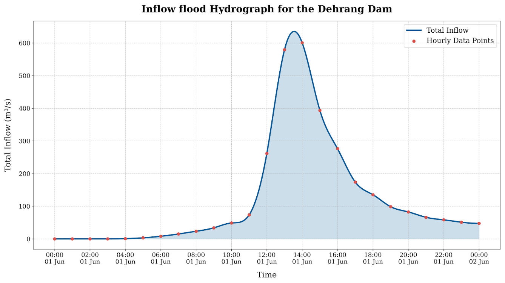
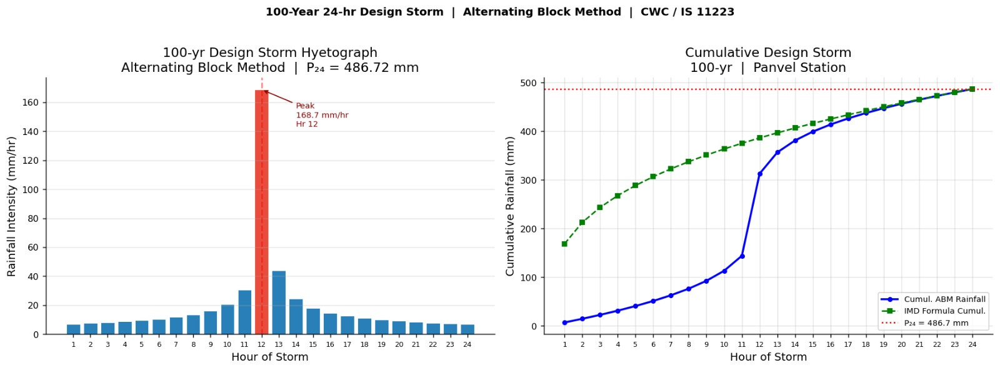

# Hydrology and HEC-HMS Methodology

## 4.1 Overview of Hydrologic Assessment

A detailed hydrologic analysis was performed using HEC-HMS 4.13 to
simulate the rainfall-runoff response of the Dehrang catchment and
generate the design inflow hydrograph to the reservoir. The Dehrang
catchment (27.00 km2) was delineated into three subbasins (Subbasin-1,
Subbasin-2, and Subbasin-3) based on GIS topographic analysis of the
Copernicus GLO-30 DEM. The subbasins drain into a single outlet (Sink-1
representing the Dehrang reservoir) via a reach routing element
(Reach-1, Muskingum method).

The catchment is situated in the Western Ghats foothills and exhibits
physiographic characteristics typical of steep, forested Konkan terrain:
flashy runoff response, near-saturated antecedent conditions during
monsoon, and rocky sub-surface geology limiting deep percolation.
Subbasin-3 has the steepest overall slope (basin slope 0.365 m/m, basin
relief 719 m) and the longest flowpath (7.21 km), while Subbasin-2 is
the smallest and flattest (basin relief 104 m, longest flowpath 1.96
km).

## 4.2 HEC-HMS Model Configuration

The HEC-HMS Basin Model (Basin 1) for the Dehrang catchment comprises
the following elements:

- 3 Subbasin elements: Subbasin-1, Subbasin-2, and Subbasin-3
  representing the GIS-delineated drainage areas

- 1 Reach element: Reach-1, using Muskingum channel routing to convey
  flows between subbasins

- 1 Sink element: Sink-1, representing the Dehrang reservoir inflow
  point

The meteorological model (100Yr_Storm_IDF) was configured as:

- Storm type: Hypothetical Storm (SCS Type II, 24-hour)

- Total 100-year 24-hour design depth: 486.72 mm (from Gumbel EV-I
  frequency analysis)

- Loss method: SCS Curve Number with AMC-II antecedent moisture
  conditions

- Transform method: SCS Unit Hydrograph (Standard PRF 484)

- Routing method: Muskingum (Reach-1)

- Baseflow: Not included (conservative assumption for design flood)

*Table 7: HEC-HMS Model Configuration Summary*

| **Parameter**               | **Value**                              |
|-----------------------------|----------------------------------------|
| **Project**                 | Dehrang_DesignFloodDBA                 |
| **Simulation Run**          | Run_100Yr_Storm_IDF                    |
| **Total Catchment Area**    | 27.00 km2                              |
| **Number of Subbasins**     | 3 (Subbasin-1, Subbasin-2, Subbasin-3) |
| **Routing Reach**           | Reach-1 (Muskingum)                    |
| **Design Storm**            | Hypothetical Storm, SCS Type II, 24-hr |
| **Design Rainfall P24,100** | 486.72 mm (Gumbel EV-I, 100-yr)        |
| **Loss Method**             | SCS Curve Number                       |
| **Transform Method**        | SCS Unit Hydrograph (Standard PRF 484) |
| **Baseflow**                | None                                   |

## 4.3 Watershed Physical Characteristics

### 4.3.1 Subbasin Physical Parameters

GeoHMS was used to extract the physical parameters for each subbasin
from the conditioned DEM. These parameters drive the SCS lag time
computation and characterise the hydrologic response of each drainage
unit. The full set of extracted parameters is presented in Table 8.

*Table 8: HEC-HMS Subbasin Physical Characteristics (GeoHMS - Copernicus

| **Parameter**                  | **Subbasin-1** | **Subbasin-2** | **Subbasin-3** | **Units** |
|--------------------------------|----------------|----------------|----------------|-----------|
| **Longest Flowpath Length**    | 5.48176        | 1.95595        | 7.21202        | km        |
| **Longest Flowpath Slope**     | 0.06604        | 0.04959        | 0.09956        | m/m       |
| **Centroidal Flowpath Length** | 2.76809        | 1.01240        | 3.69739        | km        |
| **Centroidal Flowpath Slope**  | 0.00867        | 0.00839        | 0.01406        | m/m       |
| **10-85 Flowpath Length**      | 4.11132        | 1.46697        | 5.40901        | km        |
| **10-85 Flowpath Slope**       | 0.03266        | 0.03648        | 0.11918        | m/m       |
| **Basin Slope**                | 0.30963        | 0.14472        | 0.36520        | m/m       |
| **Basin Relief**               | 595.00         | 104.00         | 719.00         | m         |
| **Relief Ratio**               | 0.10854        | 0.05317        | 0.09969        | \-        |
| **Elongation Ratio**           | 0.72240        | 0.47048        | 0.60651        | \-        |
| **Drainage Density**           | 0.10647        | 0.15787        | 0.19021        | km/km2    |

DEM)*

Subbasin-3 is the dominant hydrologic unit with the steepest terrain
(basin slope 0.365 m/m, basin relief 719 m, longest flowpath 7.21 km).
Subbasin-1 has the longest centroidal flowpath (2.77 km) and the highest
elongation ratio (0.722), indicating a more elongated shape that tends
to spread out the runoff response. Subbasin-2 is the smallest unit
(lowest basin relief of 104 m, shortest flowpath of 1.96 km) with the
lowest drainage density, and contributes directly to the reservoir
(Sink-1) without passing through Reach-1.

### 4.3.2 SCS Curve Number and Initial Abstraction

Composite Curve Numbers for each subbasin were determined using a GIS
overlay of the ESRI Living Atlas LULC classification (10-metre
resolution, Sentinel-2 2024) and USDA soil hydrologic group maps for the
Raigad district. The Dehrang catchment soils are predominantly
Hydrologic Groups B and C (lateritic and basaltic geology). AMC-II
(average antecedent moisture) conditions were applied, appropriate for a
mid-monsoon design event. The Initial Abstraction (Ia) was computed
using the standard SCS formula $$ I_a = 0.2S $$, where $$ S = \frac{25400}{CN} - 254 $$.

*Table 9: SCS Curve Number and Initial Abstraction by Subbasin*

| **Subbasin**   | **Curve Number (CN)** | **Initial Abstraction Ia (mm)** | **Impervious (%)** |
|----------------|-----------------------|---------------------------------|--------------------|
| **Subbasin-1** | **74.41**             | 17.47                           | 0.0                |
| **Subbasin-2** | **80.28**             | 12.48                           | 0.0                |
| **Subbasin-3** | **76.51**             | 15.60                           | 0.0                |

Subbasin-2 has the highest CN (80.28), reflecting a greater proportion
of developed/low-permeability land cover and/or heavier soils (Group C).
Subbasin-1 has the lowest CN (74.41), consistent with dense natural
forest and Group B soils.

### 4.3.3 Reach Routing - Muskingum Parameters

Reach-1 routes the combined outflow from Subbasin-3 and Subbasin-1
toward Sink-1 using the Muskingum method. The reach has a length of 0.09
km immediately upstream of the reservoir inflow point. The Muskingum
storage constant K = 0.24 hr represents the travel time through the
reach; the weighting parameter X = 0.4811 indicates near-equal weighting
of inflow and outflow, consistent with a relatively steep, short channel
segment.

*Table 10: Reach-1 Physical and Muskingum Routing Parameters*

| **Parameter**            | **Value**          | **Units** |
|--------------------------|--------------------|-----------|
| **Reach Name**           | Reach-1            | \-        |
| **Length**               | 0.09               | km        |
| **Channel Slope**        | 0.00000            | m/m       |
| **Sinuosity**            | 1.00000            | \-        |
| **Routing Method**       | Muskingum          | \-        |
| **Muskingum K**          | 0.24               | hr        |
| **Muskingum X**          | 0.4811             | \-        |
| **Number of Subreaches** | 1                  | \-        |
| **Initial Type**         | Discharge = Inflow | \-        |

## 4.4 Rainfall Input and Design Storm

The 100-year 24-hour design rainfall of 486.72 mm (Gumbel EV-I) was
applied to all three subbasins using the HEC-HMS Hypothetical Storm
model with the SCS Type II temporal distribution. The SCS Type II
distribution is the standard distribution paired with the SCS Unit
Hydrograph method and concentrates peak rainfall intensity in the middle
of the storm event (Hours 11-13 of 24), generating the highest peak
discharge response for this catchment type.

All subbasins receive the same total depth of 486.72 mm. The uniform
rainfall assumption is appropriate for the relatively compact catchment
(27 km2) where spatial variability in extreme rainfall is not expected
to be significant over the storm duration.

## 4.5 Time of Concentration and SCS Lag Time

The SCS lag time (tL) for each subbasin was computed internally by
HEC-HMS using the SCS lag formula from subbasin physical parameters. The
Time of Concentration (Tc) is derived as Tc = tL / 0.6, consistent with
standard SCS methodology. The lag times reflect the steep terrain and
short flowpaths of the Western Ghats catchment, resulting in rapid
hydrologic response.

*Table 11: SCS Unit Hydrograph Lag Time and Time of Concentration by

| **Subbasin**   | **Graph Type**     | **SCS Lag Time (min)** | **Tc (min)** |
|----------------|--------------------|------------------------|--------------|
| **Subbasin-1** | Standard (PRF 484) | **125.72**             | 209.53       |
| **Subbasin-2** | Standard (PRF 484) | **43.78**              | 72.97        |
| **Subbasin-3** | Standard (PRF 484) | **77.14**              | 128.57       |

Subbasin*

Subbasin-1 has the longest lag time (125.72 min, Tc = 209.53 min)
corresponding to its longer flowpath (5.48 km) and moderate slope.
Subbasin-2 has the shortest lag time (43.78 min, Tc = 72.97 min)
consistent with its compact drainage area and short flowpath of 1.96 km.
Subbasin-3, despite having the longest flowpath (7.21 km), has an
intermediate lag time (77.14 min) owing to its steep 10-85 flowpath
slope of 0.119 m/m.

## 4.6 Inflow Hydrograph Results

The HEC-HMS simulation (Run_100Yr_Storm_IDF) was executed for the period
01 June 2025 00:00 to 02 June 2025 00:00 (24-hour simulation window).
The reservoir inflow hydrograph at Sink-1 is the sum of routed flows
from Reach-1 (carrying Subbasin-1 and Subbasin-3 contributions) and
direct inflow from Subbasin-2. Key results are:

- Peak Discharge: 600.3985 m3/s at 01 Jun 2025, 14:00 hrs

- Total Inflow Volume: 10,822.487 x 10^3 m3 (10.822 MCM)

- Time to Peak from Storm Start: 14 hours

- Rise Time (0 to Peak): approximately 11 hours (rapid rising limb,
  typical of steep Western Ghats catchments)

The complete hourly inflow hydrograph is presented in Table 12. The
dominant contribution at peak is from Reach-1 (591.84 m3/s at 14:00)
reflecting the combined and routed flows from Subbasin-1 and Subbasin-3.
Subbasin-2 contributes a secondary peak of 21.996 m3/s at Hour 12,
slightly ahead of the main peak, consistent with its shorter lag time.

*Table 12: HEC-HMS Summary Results - Dehrang Reservoir Inflow (Sink-1)*

| **Parameter**               | **Value**                            |
|-----------------------------|--------------------------------------|
| **Sink**                    | Sink-1 (Reservoir Inflow)            |
| **Peak Discharge**          | **600.3985 m3/s**                    |
| **Date / Time of Peak**     | 01 Jun 2025, 14:00 hrs               |
| **Total Inflow Volume**     | 10,822.487 x 10^3 m3 (10.822 MCM)    |
| **Simulation Start**        | 01 Jun 2025, 00:00                   |
| **Simulation End**          | 02 Jun 2025, 00:00                   |
| **Time to Peak from Start** | 14 hours                             |
| **Basin Model**             | Basin 1                              |
| **Meteorologic Model**      | 100Yr_Storm_IDF (SCS Type II, 24-hr) |
| **Control Specifications**  | Control IDF                          |

*Table 13: HEC-HMS Hourly Inflow Hydrograph at Reservoir (Sink-1) -

| **Date**      | **Time**  | **Inflow from Reach-1 (m3/s)** | **Inflow from Subbasin-2 (m3/s)** | **Total Inflow to Reservoir (m3/s)** |
|---------------|-----------|--------------------------------|-----------------------------------|--------------------------------------|
| 01Jun2025     | 00:00     | 0.0000                         | 0.0000                            | 0.0000                               |
| 01Jun2025     | 01:00     | 0.0000                         | 0.0000                            | 0.0000                               |
| 01Jun2025     | 02:00     | 0.0000                         | 0.0000                            | 0.0000                               |
| 01Jun2025     | 03:00     | 0.0115                         | 0.0293                            | 0.0407                               |
| 01Jun2025     | 04:00     | 0.5320                         | 0.1569                            | 0.6888                               |
| 01Jun2025     | 05:00     | 2.8021                         | 0.3444                            | 3.1465                               |
| 01Jun2025     | 06:00     | 7.4646                         | 0.5649                            | 8.0295                               |
| 01Jun2025     | 07:00     | 14.1382                        | 0.8042                            | 14.9424                              |
| 01Jun2025     | 08:00     | 22.2742                        | 1.0518                            | 23.3261                              |
| 01Jun2025     | 09:00     | 32.3676                        | 1.4508                            | 33.8185                              |
| 01Jun2025     | 10:00     | 46.6645                        | 2.0052                            | 48.6697                              |
| 01Jun2025     | 11:00     | 70.1337                        | 3.2104                            | 73.3441                              |
| 01Jun2025     | 12:00     | 239.6509                       | 21.9958                           | 261.6467                             |
| 01Jun2025     | 13:00     | 562.0661                       | 17.3639                           | 579.4300                             |
| **01Jun2025** | **14:00** | **591.8404**                   | **8.5581**                        | **600.3985**                         |
| 01Jun2025     | 15:00     | 388.7115                       | 4.6518                            | 393.3634                             |
| 01Jun2025     | 16:00     | 272.8277                       | 3.0591                            | 275.8868                             |
| 01Jun2025     | 17:00     | 171.7661                       | 2.2674                            | 174.0335                             |
| 01Jun2025     | 18:00     | 133.3370                       | 1.8743                            | 135.2113                             |
| 01Jun2025     | 19:00     | 96.9420                        | 1.6164                            | 98.5584                              |
| 01Jun2025     | 20:00     | 81.1357                        | 1.3927                            | 82.5284                              |
| 01Jun2025     | 21:00     | 64.8610                        | 1.2183                            | 66.0794                              |
| 01Jun2025     | 22:00     | 57.1328                        | 1.1290                            | 58.2618                              |
| 01Jun2025     | 23:00     | 50.0502                        | 1.0699                            | 51.1201                              |
| 02Jun2025     | 00:00     | 46.4185                        | 1.0255                            | 47.4440                              |

100-Year 24-Hour Storm \[Peak row highlighted\]*

*Figure 3.3: 100-Year Design Storm Hydrograph*

## 4.7 Interpretation for Dam Break Analysis

The peak inflow of 600.3985 m3/s at Hour 14 is sharply defined, with the
hydrograph rising steeply from 73.34 m3/s (Hour 11) to 600.40 m3/s (Hour
14) within three hours. This rapid rise reflects the high rainfall
intensities delivered by the SCS Type II storm in the central period
combined with the steep, responsive nature of the catchment. The total
inflow volume of 10.822 MCM significantly exceeds the current reservoir
gross storage of 2.352 MCM at FRL, confirming that overtopping is
hydrologically plausible under the 100-year design event if the
reservoir is at or near FRL at storm onset and gates are unable to
discharge sufficiently.

For the piping failure scenario, the inflow boundary condition is set to
a constant baseflow of 3 m3/s, representing typical fair-weather
low-flow conditions in the Gadhi River during the pre-monsoon period,
appropriate for a non-flood structural failure event.
