# Dam-Break Analysis

## 5.1 Model Selection - HEC-RAS 6.6 (2D)

HEC-RAS 6.6, developed by the US Army Corps of Engineers Hydrologic
Engineering Center, was selected for the dam breach simulation of
Dehrang Dam. A two-dimensional (2D) unsteady flow modelling approach was
adopted, consistent with the CWC Guidelines for Developing Emergency
Action Plans for Dams (2016) and CDSO Dam Safety Guidelines (2018). The
2D approach is strongly recommended over 1D methods for complex
floodplains with multiple flow paths, backwater areas, and areas of
significant lateral spreading, all of which are characteristic of the
Gadhi River floodplain downstream of Dehrang Dam.

Key capabilities of HEC-RAS 6.6 that make it appropriate for this study
include:

1.  2D Unsteady Diffusion Wave Equation Set applied on an unstructured
    mesh, providing computationally efficient and numerically stable
    routing of the dam-break flood wave across the downstream domain.

2.  Simultaneous modelling of a Storage Area (SA) representing the
    reservoir volume-elevation relationship and a 2D Flow Area (2D FA)
    representing the downstream floodplain.

3.  SA-2D Connection with user-specified breach geometry and
    progression, directly linking reservoir drawdown to downstream flood
    wave generation.

4.  Mixed subcritical and supercritical flow regime handling via an
    implicit diffusion wave or full momentum solver, important for steep
    reaches immediately downstream of the dam.

5.  Native production of output rasters: Maximum Water Depth, Maximum
    Velocity, Arrival Time, Maximum WSE, and Depth x Velocity (D x V)
    hazard classification maps.

6.  Direct integration of GIS terrain data (Copernicus DEM GLO-30) and
    LULC-based Manning's roughness assignments.

## 5.2 Dam-Breach Scenarios

Two failure scenarios were modelled for Dehrang Dam in compliance with
CWC (2016) EAP guidelines which require analysis of at least the
Probable Maximum Flood overtopping condition and a fair-weather piping
failure condition:

### 5.2.1 Scenario A - Overtopping Failure (Flood-Induced)

Mechanism: Progressive overtopping of the earthen embankment following
inflow of the 100-year 24-hour design flood. As the reservoir fills
beyond the FRL and gates reach their operational discharge capacity,
water overtops the crest of the earthen bund. Continued overtopping
erodes the downstream face of the embankment, leading to progressive
widening of the breach.

- Initial Reservoir Level: 90.0 m MSL (above FRL of 89.15 m MSL,
  reflecting pre-storm reservoir condition and rising water level)

- Inflow Boundary: HEC-HMS 100-year 24-hour SCS Type II design flood
  hydrograph (peak 600.4 m3/s at Hour 14)

- Breach Trigger: WSE reaches 90.0 m MSL

- Breach Formation Time: 1.04 hrs (rapid embankment erosion consistent
  with earthen dam under sustained overtopping)

- Final Breach Geometry: Bottom width 34 m, bottom elevation 81.4 m MSL,
  side slopes 1H:1V (trapezoidal)

### 5.2.2 Scenario B - Piping Failure (Fair-Weather / Structural)

Mechanism: Internal erosion (piping) initiating within the dam body or
foundation at or near the riverbed level, while the reservoir is at the
Full Reservoir Level under summer low-flow conditions. This scenario
represents the worst-case non-flood structural failure condition and is
particularly relevant for ageing earthen dams such as Dehrang Dam
(constructed 1957, age 68 years), where internal erosion risk
accumulates with time.

- Initial Reservoir Level: 89.15 m MSL (Full Reservoir Level)

- Inflow Boundary: Constant baseflow of 3 m3/s (pre-monsoon low-flow,
  Gadhi River)

- Breach Trigger: Set time (piping is assumed to initiate at the start
  of simulation)

- Initial Piping Elevation: 75.40 m MSL (riverbed/foundation level)

- Breach Formation Time: 4.0 hrs (Froehlich 2008 estimate; slower
  initial development than overtopping)

- Final Breach Geometry: Bottom width 23 m, bottom elevation 75.40 m
  MSL, side slopes 1.4H:1V (trapezoidal)

***Note:** The piping scenario produces a larger total outflow volume
than overtopping for the same initial WSL, as the piping breach erodes
to the riverbed (75.40 m MSL) rather than stopping at 81.4 m MSL,
mobilising the full reservoir storage. However, the slower formation
time compared to the overtopping event reduces the peak outflow rate.*

## 5.3 Data Inputs for the Hydraulic Model

### 5.3.1 Terrain Data - Digital Elevation Model

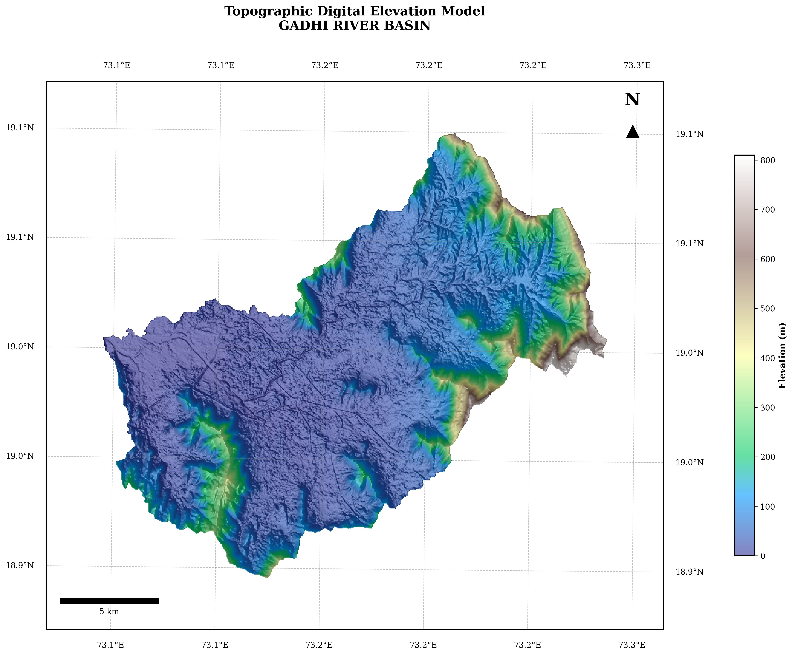

Figure 5.1: Topographic Digital Elevation Model (Copernicus DEM) – Gadhi
River Basin; Elevation range 0–800 m MSL

The terrain basis for the HEC-RAS 2D model was the Copernicus DEM Global
30-metre (GLO-30) product, accessed through the OpenTopography API. The
GLO-30 DEM provides a horizontal resolution of approximately 25-30 m in
the study area, derived from TanDEM-X radar data. The DEM was projected
to the local UTM coordinate system (Zone 43N, WGS84) and hydrologically
conditioned to enforce flow connectivity along the Gadhi River main
channel and its tributaries. Key conditioning steps included:

1.  Pit filling to remove spurious sinks in the DEM that would block
    flow routing

2.  Stream burning along the mapped Gadhi River channel thalweg to
    ensure the 30 m DEM correctly represents the channel bed

3.  Clipping to the study domain boundary extending from the dam toe to
    the downstream tidal influence zone near the Panvel Creek confluence

### 5.3.2 Land Use / Land Cover and Manning's Roughness

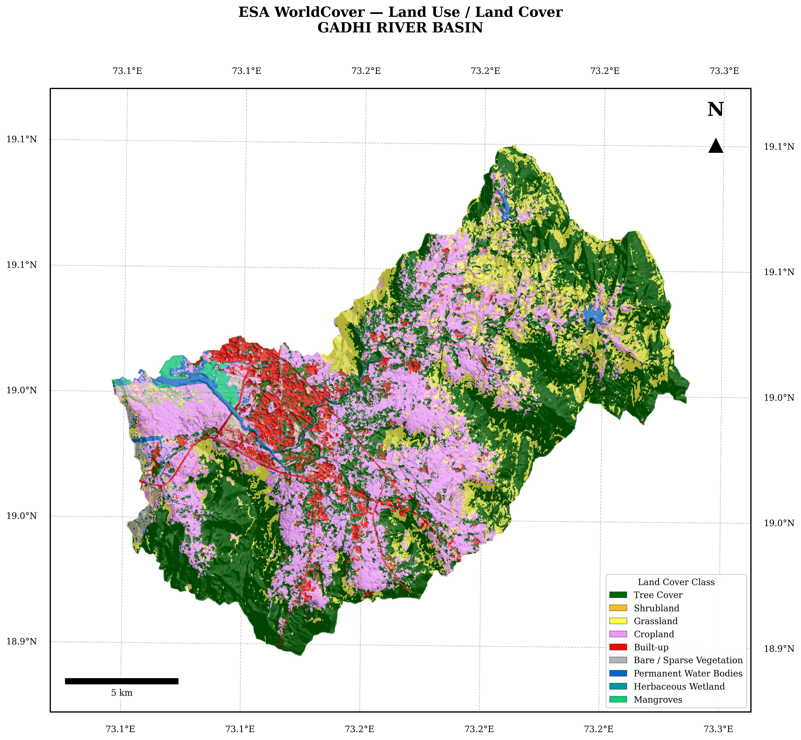

Figure 5.2: ESA WorldCover Land Use / Land Cover Classification – Gadhi
River Basin (2021)

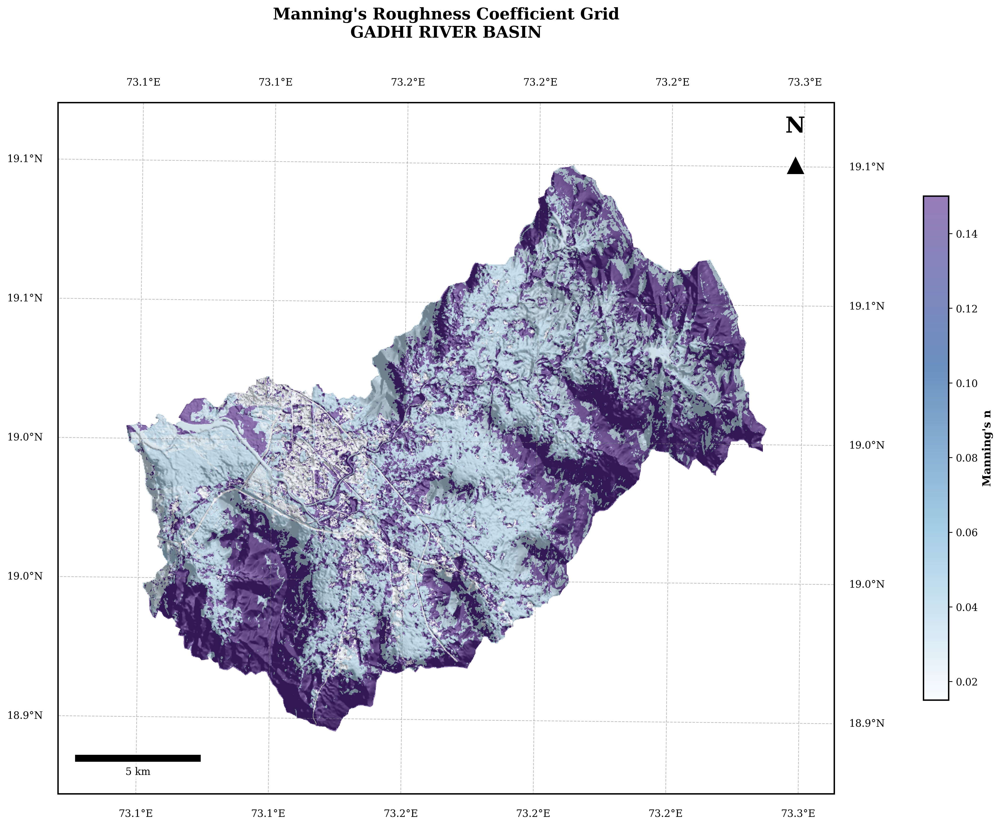

Figure 5.3: Manning's Roughness Coefficient (n) Grid derived from ESA
WorldCover – Gadhi River Basin

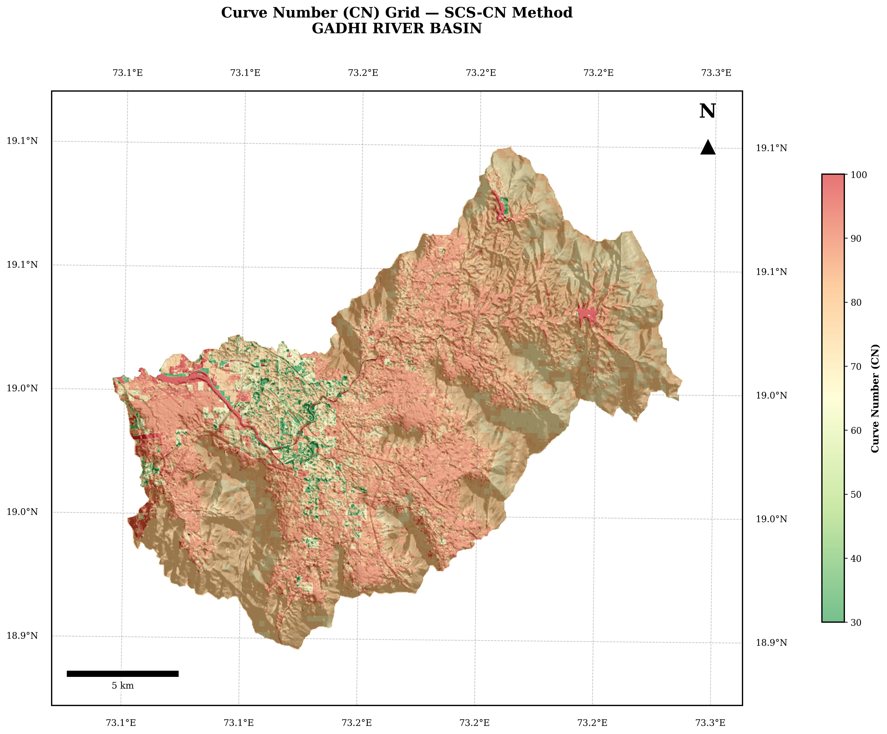

Figure 5.4: Curve Number (CN) Grid – SCS-CN Method, Gadhi River Basin

Land Use / Land Cover (LULC) data was obtained from the ESRI Living
Atlas 2024 Sentinel-2 derived global LULC product at 10-metre
resolution. Classes within the Gadhi River floodplain domain were mapped
and Manning's roughness coefficients (n) were assigned per the values
tabulated in Table 9 (Section 6.1.2). The dominant LULC classes in the
downstream floodplain are Mixed Forest/Vegetation (n = 0.16), Developed
Low-Intensity areas (n = 0.10), and Pasture/Grassland (n = 0.030) along
the river corridor.

### 5.3.3 Reservoir Geometry

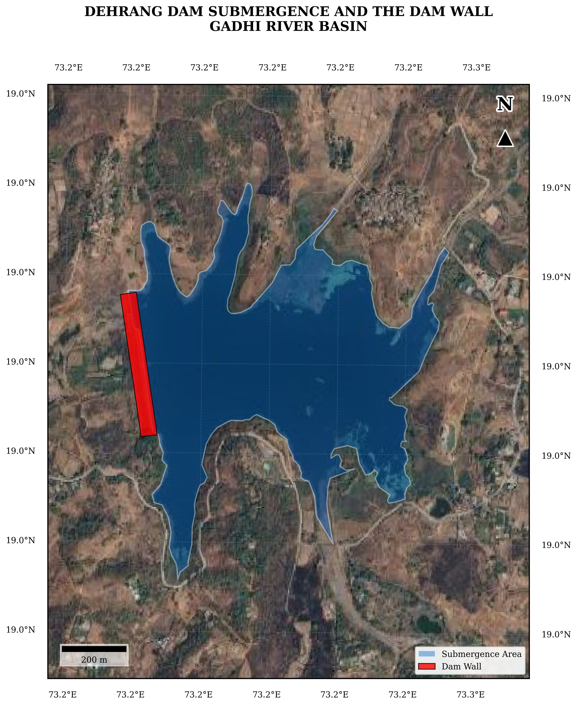

Figure 5.5: Dehrang Dam – Reservoir Submergence Area and Dam Wall
Location (FRL = 89.15 m MSL)

The Dehrang reservoir storage area was defined in HEC-RAS using the 2025
Elevation-Area-Capacity (EAC) survey data (Annexure I). The
volume-elevation table was entered directly into the HEC-RAS Storage
Area element. The FRL of 89.15 m MSL corresponds to a gross storage
volume of 2,351.58 x 10^3 m3 (2.352 MCM), reflecting the post-siltation
condition.

### 5.3.4 Spillway Representation

The Dehrang Dam spillway, comprising 11 Godbole-type Automatic Tilting
Gates (each 8.70 m x 2.50 m, gate sill at 86.65 m MSL), was represented
in the HEC-RAS SA-2D connection as a weir/gate structure with a total
gated length of 111 m. The gate discharge relationship was defined based
on the design head-discharge characteristics. For the overtopping
scenario, gate operation is assumed at design capacity; when reservoir
WSE exceeds 90.0 m MSL (the breach trigger), the breach mechanism is
activated on the earthen bund section adjacent to the spillway at Centre
Station 159 m.

# HEC-RAS Breach Simulation Methodology

This section details the complete 2D hydraulic model setup in HEC-RAS
6.6, including mesh construction, terrain and roughness assignment,
breach parameterisation using Froehlich (2008) empirical equations, and
simulation execution procedures for both failure scenarios.

## 6.1 2D Hydraulic Model Overview

The HEC-RAS model for Dehrang Dam comprises two primary hydraulic
elements: a Storage Area (SA) representing the reservoir and an
unstructured 2D Flow Area (2D FA) covering the downstream floodplain
from the dam toe to the tidal influence boundary near Panvel Creek.
These are connected via an SA-to-2D Area hydraulic structure (SA2D
Conn 1) at which the breach is specified.

### 6.1.1 Model Domain and Mesh

The 2D Flow Area mesh was constructed from the hydrologically
conditioned Copernicus GLO-30 DEM. The computational mesh covers the
Gadhi River valley from the dam toe through all downstream settlements
likely to be impacted by dam breach flows. Mesh refinement was applied
in areas of higher hydraulic complexity including the channel thalweg,
road embankments acting as flow constrictions, and the immediate dam toe
area where the breach outflow undergoes rapid expansion.

- Terrain: Copernicus DEM GLO-30 (30 m horizontal resolution, WGS84 UTM
  Zone 43N)

- Mesh type: Unstructured (mixed triangular and quadrilateral elements)

- Solver: 2D Unsteady Diffusion Wave Equation Set (Fastest Mode); 8
  solver cores; 1-second computational time step; 10-minute output
  intervals

- Computational time step: 10 seconds (adaptive during breach phase)

### 6.1.2 Boundary Conditions

The following boundary conditions were applied consistently across both
simulation plans:

- Upstream (SA Inflow): HEC-HMS design flood hydrograph (600.4 m3/s
  peak) for the overtopping scenario; constant 3 m3/s baseflow for the
  piping scenario

- Downstream (2D FA outlet): Normal depth boundary using the DEM-derived
  longitudinal water surface slope at the downstream domain boundary

- Initial condition: Reservoir at FRL = 89.15 m MSL (piping plan) or at
  90.0 m MSL (overtopping plan, consistent with rising storm conditions)

- Dry land initial conditions applied to the 2D flow area (no
  pre-existing flood water in floodplain)

### 6.1.3 Land Cover and Manning's Roughness

Manning's roughness coefficient (n) values were spatially distributed
across the 2D mesh based on the ESRI Living Atlas LULC classification.
The roughness assignment follows standard HEC guidance for 2D models.
Values used are summarised in Table 14.

*Table 14: Manning's Roughness Coefficients by LULC Class*

| ESA_Code | name                   | **n** |
|----------|------------------------|-------|
| 10       | Tree cover             | 0.15  |
| 20       | Shrubland              | 0.08  |
| 30       | Grassland              | 0.035 |
| 40       | Cropland               | 0.045 |
| 50       | Built-up               | 0.015 |
| 60       | Bare/sparse vegetation | 0.025 |
| 70       | Snow and ice           | 0.01  |
| 80       | Permanent water bodies | 0.03  |

The channel thalweg of the Gadhi River was assigned a roughness value of
n = 0.035 (natural channel with gravel bed and minimal vegetation),
consistent with its steep gradient and cobble-gravel substrate typical
of Western Ghats hill streams. Densely vegetated floodplain areas use n
= 0.16 which substantially attenuates flood wave propagation in the
riparian zone.

## 6.2 Breach Parameterisation - Froehlich (2008) Method

Breach parameters for both failure scenarios were derived using the
Froehlich (2008) empirical regression equations, the standard method
recommended by CWC (2016) and CDSO (2018) for Indian dam safety
analysis. Froehlich (2008) developed equations based on 74 case studies
of dam failures, relating breach geometry and formation time to
reservoir volume and breach height:

 B_{avg} = 0.1803 \cdot K_0 \cdot V_w^{0.32} \cdot H_b^{0.19} 

 t_f = 0.0179 \cdot V_w^{0.53} \cdot H_b^{-0.90} 

*where: K0 = 1.0 (overtopping) or 0.7 (piping); Vw = volume of water
(m3); Hb = breach height (m)*

For Dehrang Dam, the key input parameters are: **Vw** =
2,351,580 m3 (gross storage at FRL from 2025 survey); for overtopping,
Hb = 90.0 - 81.4 = 8.6 m (water surface above final breach invert); for
piping, Hb = 89.15 - 75.40 = 13.75 m (full head from FRL to riverbed).
Computed values closely match the entered model parameters as detailed
below.

### 6.2.1 Overtopping Failure - Plan: DEH-OVTP-PL

The overtopping breach was configured in HEC-RAS Plan DEH-OVTP-DBA. The
SA-to-2D connection (SA2D Conn 1) represents the full 335 m dam
alignment; the breach is centred at Station 159 m, corresponding to the
lowest section of the earthen bund adjacent to the concrete spillway
structure. Breach parameters are tabulated in Table 15.

*Table 15: Breach Parameters - Overtopping Failure Scenario (Plan:

| **Parameter**               | **Value**                                  |
|-----------------------------|--------------------------------------------|
| **SA Connection**           | SA2D Conn 1                                |
| **Breach Centre Station**   | 159 m                                      |
| **Final Bottom Width**      | 34 m                                       |
| **Final Bottom Elevation**  | 81.4 m MSL                                 |
| **Left Side Slope (H:V)**   | 1.0                                        |
| **Right Side Slope (H:V)**  | 1.0                                        |
| **Breach Weir Coefficient** | 1.44                                       |
| **Breach Formation Time**   | 1.04 hrs                                   |
| **Failure Mode**            | Overtopping                                |
| **Trigger WSE**             | 90.0 m MSL (WS Elev trigger)               |
| **Starting Water Surface**  | 90.0 m MSL                                 |
| **Parameterization Method** | User Entered Data (Froehlich 2008 derived) |

DEH-OVTP-PL)*

The overtopping breach triggers when the reservoir WSE reaches 90.0 m
MSL (configured as a WS Elevation trigger in HEC-RAS). The breach erodes
from the dam crest downward to the final bottom elevation of 81.4 m
MSL - well above the riverbed - reflecting the typical behaviour of
earthen dam overtopping failure where the breach is limited by the
erosion-resistant core or by the extent of embankment material
available. The 1.04-hour formation time reflects the rapid erosion
expected under sustained overtopping of this compact embankment.

### 6.2.2 Piping Failure - Plan: DEH-PIPG-DBA

The piping failure breach was configured in a separate HEC-RAS plan
(DEH-PIPG-DBA) using the same SA-2D connection geometry. The piping
mechanism is modelled using the User Entered Data breach method, with
Froehlich (2008) empirical equations applied to compute breach
parameters at the pool elevation of 89.15 m MSL (FRL). Initial piping
initiates at elevation 81.5 m MSL, and the breach erodes to a final
bottom elevation of 81.4 m MSL. The reservoir is pre-set at FRL (89.15 m
MSL) with a constant baseflow of 3 m3/s and the breach trigger is set to
initiate at 01 January 2025 01:00. Parameters are derived from Froehlich
(2008) equations and are tabulated in Table 16.

*Table 16: Breach Parameters - Piping Failure Scenario (Plan:

| **Parameter**                | **Value**                                                              |
|------------------------------|------------------------------------------------------------------------|
| **SA Connection**            | SA2D Conn 1 (separate piping plan)                                     |
| **Breach Centre Station**    | 159 m                                                                  |
| **Failure Mode**             | Piping (Internal Erosion)                                              |
| **Initial Piping Elevation** | 81.5 m MSL (initial piping elevation, mid-embankment)                  |
| **Final Bottom Elevation**   | 81.4 m MSL (embankment base erosion limit)                             |
| **Final Bottom Width**       | 33 m (Froehlich 2008: K0=0.7, Vw=2238.652x10^3 m3, Hb=7.75 m)          |
| **Left Side Slope (H:V)**    | 1.4                                                                    |
| **Right Side Slope (H:V)**   | 1.4                                                                    |
| **Piping Coefficient**       | 0.5                                                                    |
| **Breach Formation Time**    | 0.98 hrs (Froehlich 2008, Vw=2238.652x10^3 m3, Hb=7.75 m)              |
| **Trigger**                  | WS Elevation trigger at 89.15 m MSL (FRL); constant baseflow of 3 m3/s |
| **Starting Water Surface**   | 89.15 m MSL (FRL)                                                      |
| **Parameterization Method**  | Froehlich (2008) Empirical Equations                                   |

DEH-PIPG-DBA, Froehlich 2008 Derived)*

The piping breach initiates at elevation 81.5 m MSL and erodes to a
final invert of 81.4 m MSL, with a final bottom width of 33 m and 1H:1V
side slopes. The breach formation time of 0.98 hours (per Froehlich
2008) is comparable to the overtopping case. Unlike the overtopping
scenario, the piping failure initiates under fair-weather conditions
from FRL (89.15 m MSL) without any storm forcing, making it more
dangerous from an emergency warning perspective.

## 6.3 Simulation Controls and Execution

Both simulation plans were executed with consistent computational
settings to enable direct comparison of results:

- Overtopping scenario: 31 May 2025 2400 to 02 June 2025 1200 (36
  hours); Piping scenario: 01 January 2025 0100 to 03 January 2025 0100
  (48 hours). Both simulation windows are sufficient to capture full
  flood wave propagation through the study domain and reservoir
  drawdown.

- Computational time step: 1 second (fixed); this fine time step ensures
  numerical stability and accurate capture of the rapidly varying breach
  hydrograph during breach formation and peak outflow phases

- Mapping output interval: 10 minutes (for all spatial raster outputs)

- Time series output interval: 10 minutes (for hydrograph and stage
  time-series extraction at all monitoring locations and SA connections)

- 2D solver: 2D Unsteady Diffusion Wave Equation Set (fastest mode)
  applied uniformly across the entire 2D mesh domain, consistent with
  the Diffusion Wave approximation of the shallow water equations. This
  solver neglects the convective acceleration terms in the momentum
  equation, providing computationally efficient and stable solutions for
  dam-break flood routing where flow is predominantly driven by pressure
  and gravity gradients.

- Warmup period: 2-hour pre-breach simulation to establish steady
  initial conditions before breach trigger

Output products generated for each simulation plan:

1.  Maximum Water Surface Elevation (WSE) raster (m MSL)

2.  Maximum Water Depth raster (m above ground)

3.  Maximum Depth-Averaged Velocity raster (m/s)

4.  Flood Wave Arrival Time raster (hours from breach initiation)

5.  Depth x Velocity (D x V) product raster for hazard classification

6.  Inundation boundary polygon (shapefile) at 0.1 m depth threshold

7.  Time-series hydrographs at key downstream cross-sections and
    settlement boundaries

## 6.4 Flood Hazard Vulnerability Classification

Flood hazard maps were produced for both breach scenarios using the
Depth x Velocity (D x V) product methodology, which integrates both
depth and dynamic force of floodwaters into a single hazard indicator.
This approach is standard in CWC (2016) EAP guidance and is consistent
with international dam safety practice (ACER, 1988; ANCOLD, 2003). The
six-tier hazard classification applied is presented in Table 17.

*Table 17: Flood Hazard Vulnerability Classification - D x V Thresholds*

| **Hazard Class** | **Description**                                                          | **D x V Limit** | **Limiting Depth (m)** | **Limiting Velocity (m/s)** |
|------------------|--------------------------------------------------------------------------|-----------------|------------------------|-----------------------------|
| **H1**           | Generally safe for vehicles and people                                   | D x V \< 0.3    | 0.3 m                  | 2.0 m/s                     |
| **H2**           | Unsafe for small vehicles                                                | D x V \< 0.6    | 0.5 m                  | 2.0 m/s                     |
| **H3**           | Unsafe for vehicles, children and the elderly                            | D x V \< 0.6    | 1.2 m                  | 2.0 m/s                     |
| **H4**           | Unsafe for vehicles and people                                           | D x V \< 1.0    | 2.0 m                  | 2.0 m/s                     |
| **H5**           | Unsafe for vehicles and people; less robust buildings subject to failure | D x V \< 4.0    | 4.0 m                  | 4.0 m/s                     |
| **H6**           | All building types considered vulnerable to failure                      | D x V \> 4.0    | \-                     | \-                          |

The hazard class H1 (D x V \< 0.3) defines zones that are generally safe
for orderly evacuation of vehicles and ambulatory adults. Class H2 (D x
V \< 0.6) is unsafe for small vehicles and should be evacuated before
flood arrival. Classes H3 and H4 are dangerous to all people and
represent the primary evacuation priority zone in an Emergency Action
Plan. Classes H5 and H6 represent catastrophic flood conditions where
structural failure of buildings is likely and survival without
evacuation is improbable.

The D x V raster was computed as a cell-by-cell product of the Maximum
Depth and Maximum Velocity rasters from each simulation. Hazard class
boundaries were applied using GIS reclassification. Areas where maximum
depth was less than 0.1 m were excluded from the hazard mapping as no
significant hazard is posed.

***Note:** Hazard classes should be interpreted in conjunction with
flood wave arrival times. An area classified H4 that has a 4-hour
arrival time is more manageable for evacuation than the same hazard
class with a 30-minute arrival time. EAP preparation must account for
both hazard severity and available warning time.*

## Annexure IV — Froehlich (2008) Breach Parameter Derivation

- Froehlich (2008) Breach Parameter Derivation

Breach parameters for both failure scenarios were derived from Froehlich
(2008) empirical equations. The methodology is summarised below for
transparency and QA purposes. The Froehlich (2008) equations are based
on regression analysis of 74 documented dam failure case studies and are
recommended by CWC (2016) EAP Guidelines and CDSO (2018) for breach
parameter estimation in Indian dam safety analysis.

## A. Input Parameters

Reservoir volume at trigger WSL:

- Overtopping (WSL = 90.0 m MSL): Vw 2,351,580 m3 (gross storage at FRL
  89.15 m MSL, conservative estimate used)

- Piping (WSL = 89.15 m MSL): Vw = 2,351,580 m3 (gross storage from 2025
  survey)

Breach height Hb:

- Overtopping: Hb = Trigger WSL - Final Breach Bottom Elev = 90.0 - 81.4
  = 8.6 m

- Piping: Hb = FRL - RBL = 89.15 - 75.40 = 13.75 m

## B. Froehlich (2008) Equations and Computed Values

**Average Breach Width:** $$ B_{avg} = 0.1803 \cdot K_0 \cdot V_w^{0.32} \cdot H_b^{0.19} $$

**Formation Time:** $$ t_f = 0.0179 \cdot V_w^{0.53} \cdot H_b^{-0.90} $$

*K0 = 1.0 (overtopping); K0 = 0.7 (piping); Vw in m3; Hb in m*

| **Parameter**                      | **Overtopping (OT)**                                   | **Piping (PI)**                                        |
|------------------------------------|--------------------------------------------------------|--------------------------------------------------------|
| **Failure mode constant K0**       | 1.0                                                    | 0.7                                                    |
| **Volume of water Vw (m3)**        | 2,538,650 (at pool elevation WSL 90.0 m MSL, from EAC) | 2,238,652 (at pool elevation WSL 89.0 m MSL, from EAC) |
| **Breach height Hb (m)**           | 8.6 (90.0 - 81.4 m final breach invert, overtopping)   | 7.75 (89.15 - 81.4 m final breach invert)              |
| **Froehlich Bavg (m)**             | 32 m (model uses 34 m)                                 | 33 m                                                   |
| **Froehlich tf (hrs)**             | 1.0 hr (model uses 1.04 hrs)                           | 0.98 hrs                                               |
| **Froehlich side slope z (H:V)**   | 1.0 (overtopping)                                      | 1.0 (piping, per Froehlich 2008 for this case)         |
| **Final bottom width (model)**     | 34 m                                                   | 23 m                                                   |
| **Final bottom elevation (model)** | 81.4 m MSL                                             | 81.4 m MSL                                             |
| **Breach weir coefficient**        | 1.44                                                   | \-                                                     |
| **Piping coefficient**             | \-                                                     | 0.5                                                    |

*Annexure IV: Froehlich (2008) Breach Parameter Derivation Summary*

***Note:** The overtopping model breach parameters (34 m bottom width,
1.04 hr formation time, 81.4 m invert) are consistent with Froehlich
(2008) equations and were entered as User Entered Data in HEC-RAS Plan
DEH-OVTP-DBA. The piping scenario parameters (33 m bottom width, 0.98 hr
formation time, 81.4 m invert, Initial Piping Elevation 81.5 m MSL) were
derived from Froehlich (2008) using pool volume Vw=2,238,652 m3 and
breach height Hb=7.75 m, and entered as User Entered Data in HEC-RAS
Plan DEH-PIPG-DBA*

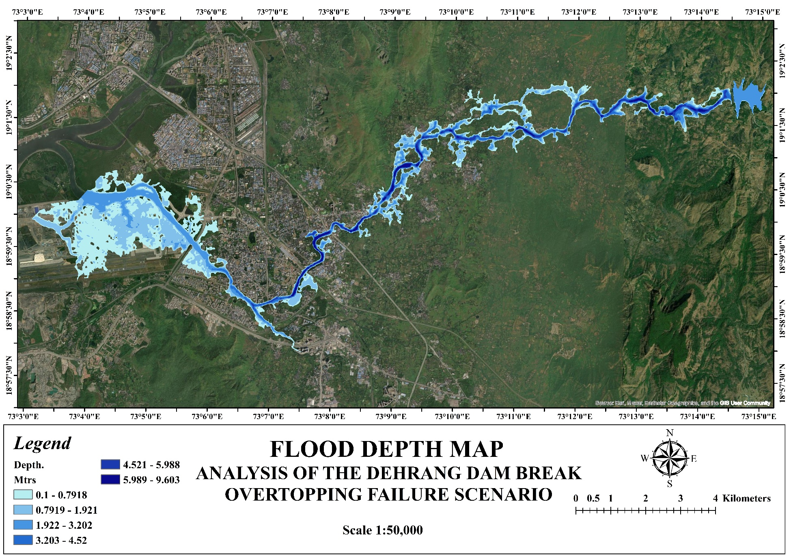

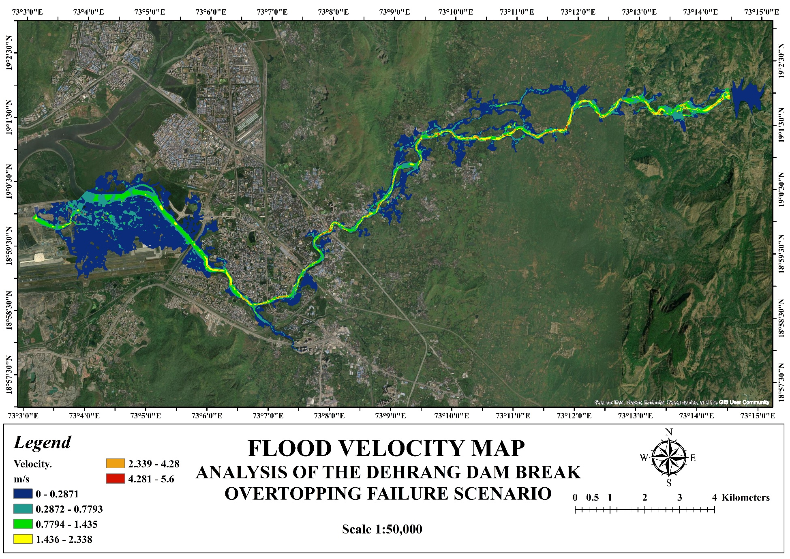

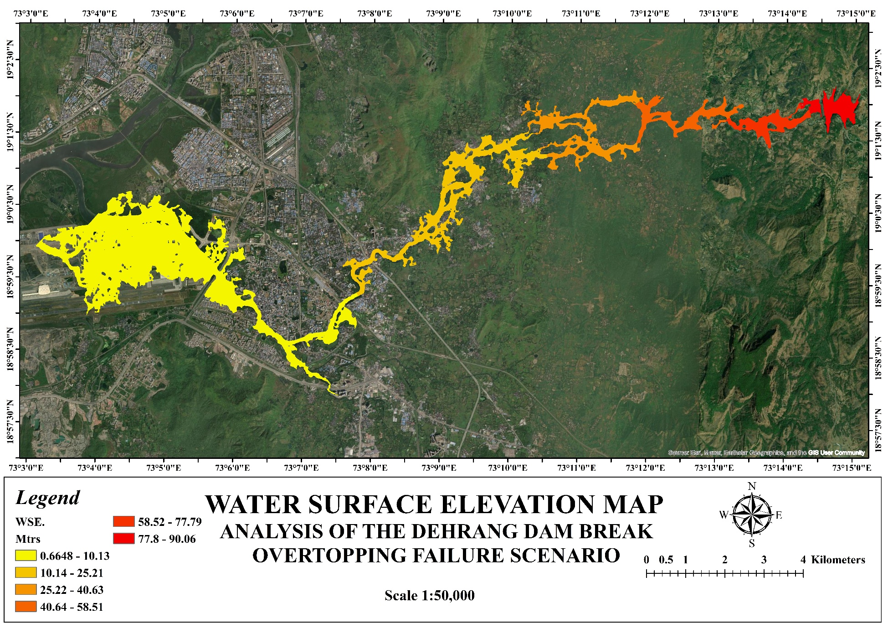

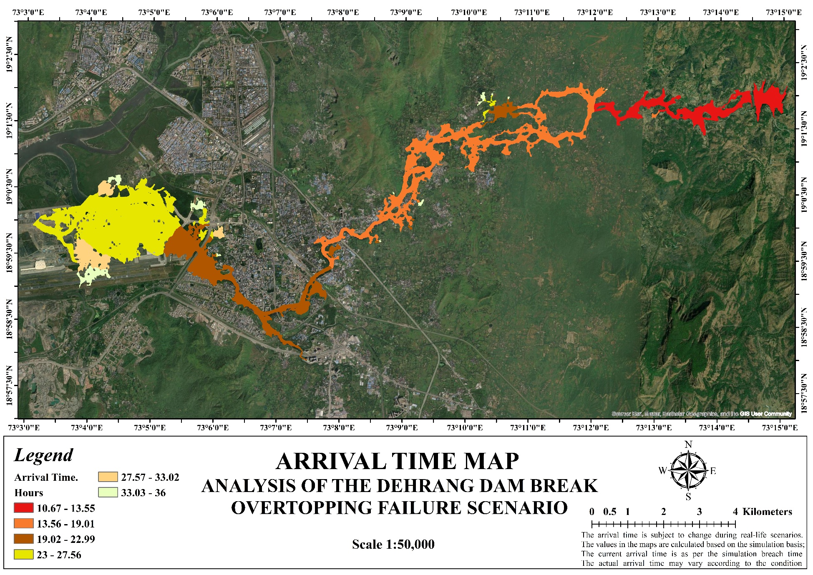

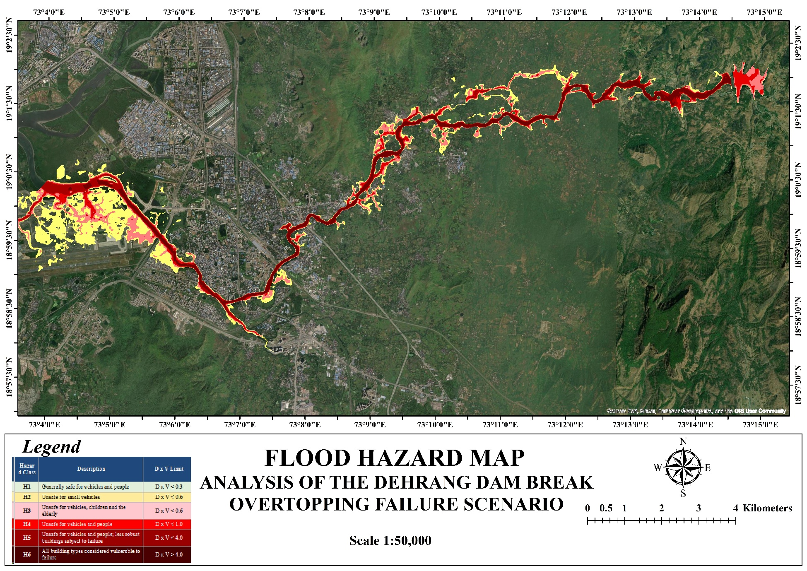

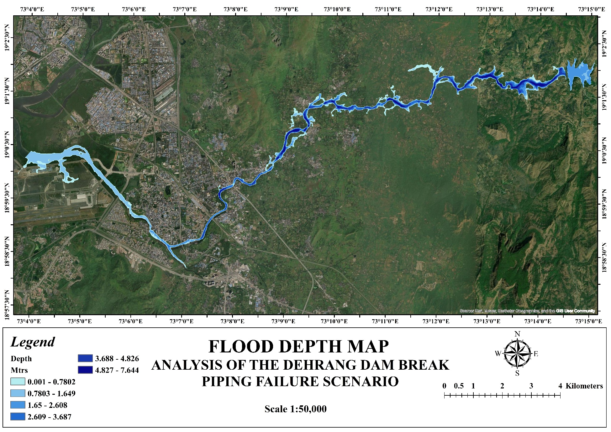

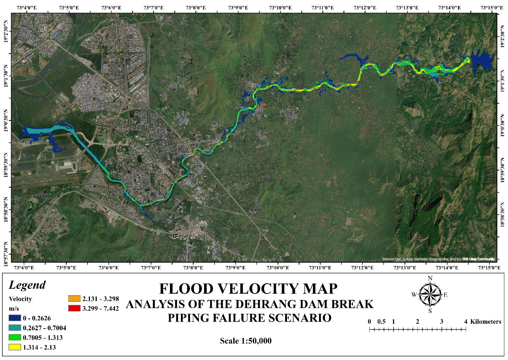

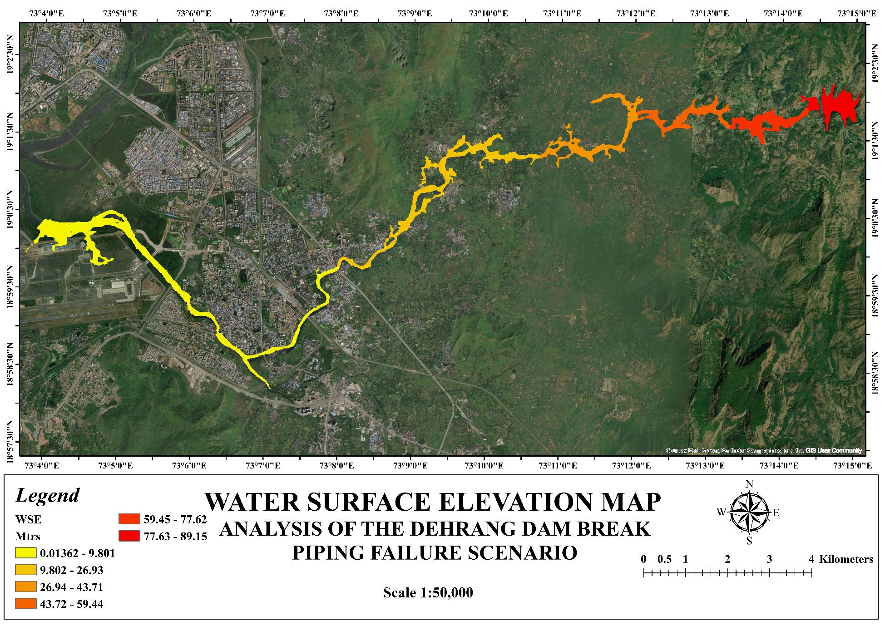

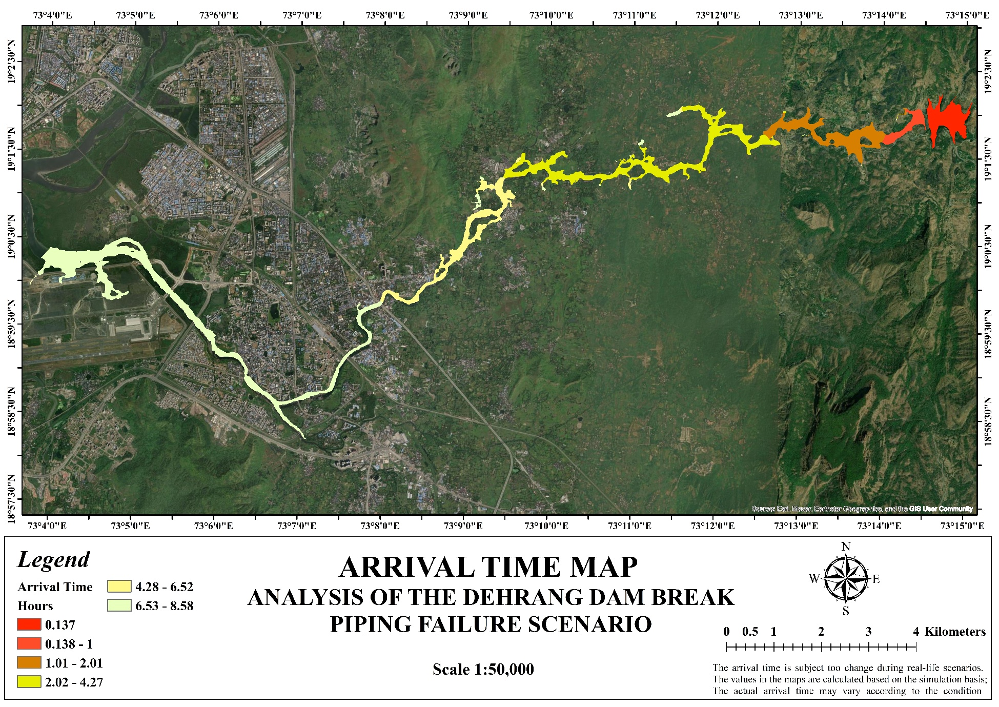

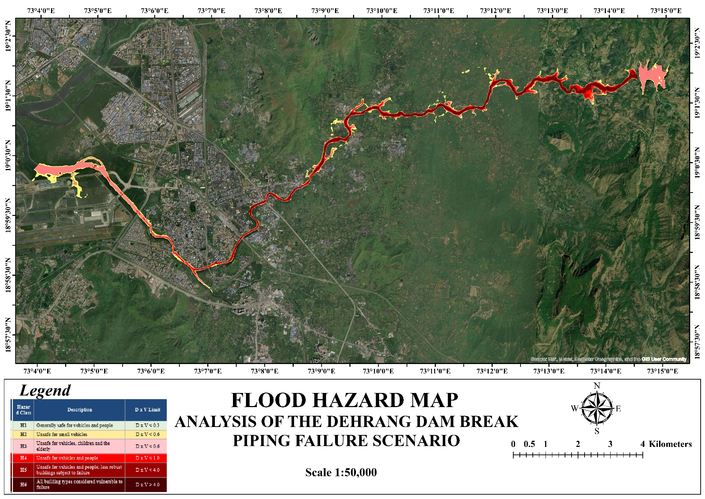

***Note:** The H1 hazard class is not severe and has very low pixel
visibility because the depth values range from 0.01 to 0.05 meters.
Therefore, the Hazard Vulnerability Index should be used only for
preliminary planning, as the actual hazard may vary with terrain and
other factors.*

