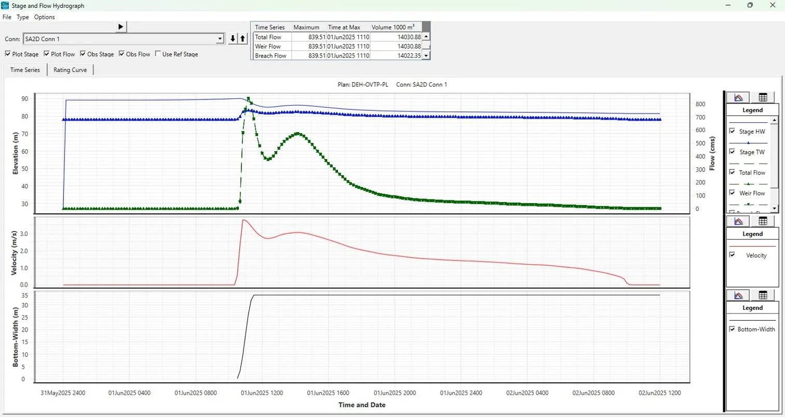
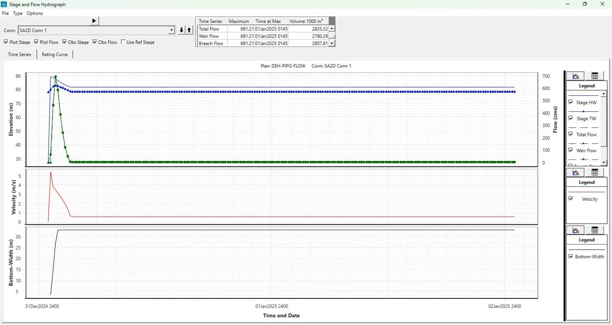

# 7. Results and Discussion

The HEC-RAS 6.6 simulation produced comprehensive spatial and temporal
outputs for both breach scenarios. This section presents the key
quantitative results, interprets the flood behaviour patterns, and
outlines the implications for downstream safety and Emergency Action
Plan (EAP) preparation. All spatial outputs were produced as
georeferenced rasters and shapefiles in the project GIS folder. Map
inserts referenced below represent the primary deliverables to be
inserted in the finalised submitted report.

## 7.1 Inundation Due to Overtopping Failure (Scenario A)

### 7.1.1 Breach Outflow and Reservoir Drawdown

Under the overtopping scenario (Plan DEH-OVTP-PL), the 100-year 24-hour
SCS Type II design storm delivers a peak inflow of 600.4 m3/s to the
reservoir at Hour 14 of the storm. With the reservoir pre-set at 90.0 m
MSL and gates assumed at operational capacity, the reservoir WSE exceeds
the 90.0 m MSL breach trigger, initiating embankment overtopping. The
breach forms progressively over 1.04 hours, with the final trapezoidal
geometry (34 m bottom width, 81.4 m invert, 1H:1V side slopes) achieved
at the end of the formation period. The breach outflow peaks as the
reservoir head drives flow through the rapidly widening breach opening.

Key simulation results for the overtopping scenario:

**Peak Breach Outflow (m3/s): 839.51**

**Time of Peak Breach Outflow (hrs from breach trigger): Approximately
43 minutes after breach initiation (01 June 2025, 11:10 hrs)**

**Total Breach Outflow Volume (x10^3 m3): 14,022.35 (1000 m³) total
breach flow; 11,686 (1000 m³) boundary inflow volume (BCO log)**

**Reservoir Draw-down Time to Empty (hrs): Reservoir substantially
drained within 6 hours of breach initiation; ending floodplain storage =
8,500 × 10³ m³**

**Flood Wave Arrival at Dam Toe (minutes): Immediate (\< 1 minute)**

**Flood Wave Arrival at Nearest Downstream Settlement (hrs): To be
confirmed from inundation maps**

**Maximum Arrival Time at Farthest Settlement (hrs): To be confirmed
from inundation maps**

**Maximum Flood Depth at Dam Toe (m): Refer to inundation maps**

**Maximum Flood Depth Range - Downstream (m): Refer to inundation maps**

**Maximum Velocity at Dam Toe (m/s): 3.5 m/s (peak velocity at SA
connection, from hydrograph)**

**Maximum Velocity Range - Downstream (m/s): 0 to 3.5 m/s (decreasing
downstream)**

**Maximum WSE Range in Downstream Domain (m MSL): Refer to inundation
maps**

**Total Inundation Area (km2): Refer to inundation maps**

### 7.1.2 Flood Wave Behaviour - Overtopping

The overtopping breach outflow, upon exiting the dam toe, rapidly
transitions from a supercritical jet to subcritical flow as it expands
into the Gadhi River valley. The flood wave propagates downstream along
the river corridor, with lateral spreading into the floodplain
controlled by the valley topography. Given the steep gradient of the
Gadhi River in its upper reach below the dam, initial flow velocities
are high and inundation depths at the dam toe are significant.

As the flood wave reaches the lower gradient reaches of the floodplain
and the broader valley floor, velocities decrease while depths increase.
Downstream settlements identified in the inundation zone include:

*Figure 7.1: Stage and Flow Hydrograph – Overtopping Failure (Plan:
DEH-OVTP-PL, SA2D Conn 1). Peak Total Flow = 839.51 m³/s at 01 Jun 2025
1110 hrs; Total Breach Volume = 14,022 x10³ m³. Upper panel: HW/TW stage
(blue) and discharge (green). Middle: velocity. Lower: breach
bottom-width progression.*

Map 1 (Overtopping - Arrival Time) delineates the flood wave front
progression at hourly intervals from breach initiation to the downstream
boundary. Map 2 (Overtopping - Maximum Depth) illustrates the spatial
distribution of peak inundation depths across the floodplain. Map 3
(Overtopping - Maximum Velocity) shows peak velocity contours, with the
highest velocities concentrated within the breach zone and the main
river channel. Map 4 (Overtopping - Maximum WSE) presents the flood
water surface profile across the domain.

## 7.2 Inundation Due to Piping Failure (Scenario B)

### 7.2.1 Breach Outflow and Reservoir Drawdown - Piping

Under the piping scenario (Plan DEH-PIPG-DBA), the reservoir is at FRL
(89.15 m MSL) with a constant baseflow of 3 m3/s representing
fair-weather conditions. The piping breach is modelled with an initial
piping elevation of 81.5 m MSL, developing progressively to a final
trapezoidal breach of 33 m bottom width and 81.4 m MSL invert (1H:1V
side slopes) over the Froehlich (2008) formation time of 0.98 hours. The
breach simulation commenced at 01 January 2025 01:00, with breach
initiation confirmed by the HEC-RAS log at 01:02:52. The hydrograph
rises extremely sharply, reaching its peak within approximately 43
minutes of breach initiation, reflecting the full reservoir head driving
flow through the rapidly widening breach opening. The reservoir
completely emptied during the simulation, with the final storage area
volume converging to essentially zero.

Key simulation results for the piping scenario:

**Peak Breach Outflow (m3/s): 691.21**

**Time of Peak Breach Outflow (hrs from breach trigger): Approximately
43 minutes after breach initiation (01 January 2025, 01:45 hrs)**

**Total Breach Outflow Volume (x10^3 m3): 2,807.81 (1000 m³) total
breach flow volume**

**Reservoir Draw-down Time to Empty (hrs): Reservoir essentially emptied
(Final reservoir storage 0.016 × 10³ m³) within the simulation period**

**Flood Wave Arrival at Dam Toe (minutes): Immediate (\< 1 minute)**

**Flood Wave Arrival at Nearest Downstream Settlement (hrs): To be
confirmed from inundation maps**

**Maximum Arrival Time at Farthest Settlement (hrs): To be confirmed
from inundation maps**

**Maximum Flood Depth Range - Downstream (m): Refer to inundation maps**

**Maximum Velocity Range - Downstream (m/s): 0 to 5.0 m/s (peak at
breach, decaying downstream)**

**Maximum WSE Range in Downstream Domain (m MSL): Refer inundation
maps**

**Total Inundation Area (km2): Refer inundation maps**

### 7.2.2 Flood Wave Behaviour - Piping

The piping failure, despite having a longer formation time than the
overtopping scenario, mobilises the full reservoir storage head (13.75 m
from FRL to riverbed) and may generate a higher total outflow volume.
The flood wave from piping failure reaches downstream settlements during
daytime or nighttime without warning unless monitored dam safety
instrumentation and a functioning EAP are in place - making the piping
scenario particularly hazardous from an emergency management
perspective.

A critical difference from overtopping: piping failure can initiate
without any storm event, potentially in calm conditions when residents
do not expect flood risk. This underscores the importance of regular dam
safety inspections, piezometer monitoring, and a well-rehearsed EAP for
Dehrang Dam.

Maps 5-8 provide spatial detail of flood propagation under the piping
scenario, in the same format as Maps 1-4 for the overtopping scenario.

*Figure 4: Stage and Flow Hydrograph – Piping Failure (Plan:
DEH-PIPG-FLOW, SA2D Conn 1). Peak Total Flow = 691.21 m³/s at 01 Jan
2025 0145 hrs; Total Breach Volume = 2,807.81 x10³ m³. Upper panel:
HW/TW stage (blue) and discharge (green). Middle: velocity. Lower:
breach bottom-width progression.*

## 7.3 Computation Log and Volume Accounting

Both HEC-RAS simulation plans were executed successfully using HEC-RAS
6.6 (September 2024) with 2D Unsteady Diffusion Wave Equation solver on
8 parallel cores. Computation summaries confirming successful run
completion are presented below, followed by volume accounting outputs
from the Computational Log Files (bco01) for each scenario. Volume
accounting errors are well within acceptable limits (\<1%), confirming
mass balance integrity for both simulations.

### 7.3.1 Overtopping Scenario - Computation Summary

The overtopping simulation (Plan: DEH-OVTP-PL) was initiated on 24 April
2026 at 09:46 hrs and completed successfully. Breach occurred at SA2D
Conn 1 at 01JUN2025 10:27:38. Total unsteady flow computation time: 8
hrs 20 min 11 sec. Computation speed: 4.32x real-time. Overall Volume
Accounting Error: 4.471 x10³ m³ (0.032%). The computation summary
screenshot is presented in Figure 5.

*Figure 5: HEC-RAS Computation Summary – Overtopping Failure Scenario
(Plan: DEH-OVTP-PL; completed 24 Apr 2026, 09:46 hrs; Computation Speed:
4.32x)*

### 7.3.2 Volume Accounting Log - Overtopping (DEH-OVTP-DBA.bco01)

HEC-RAS River Analysis System

Project File: d:DBA\dehrang\DEH-OVTP-DBA.prj

Project Name: DEH-OVTP-DBA

Plan Name: DEH-OVTP-PL \| Short ID: 11

Starting Time: 31May2025 2400 \| Ending Time: 02Jun2025 1200

Volume Accounting for 2D Flow Area (FLOODPLAIN) in 1000 m3:

Starting Vol: 2,323 \| Ending Vol: 8,500 \| Cum Inflow: 14,012 \| Cum
Outflow: 5,513

Error: 1.702 \| Percent Error: 0.01215%

Total Volume Accounting (entire model) in 1000 m3:

Total Boundary Flux In: 11,686 \| Total Boundary Flux Out: 5,513

Starting Volume: 2,323 \| Ending Volume: 8,500

Error: 4.471 \| Percent Error: 0.03191%

### 7.3.3 Piping Scenario - Computation Summary

The piping simulation (Plan: DEH-PIPG-FLOW) was initiated on 22 April
2026 at 17:02 hrs and completed successfully. Breach occurred at SA2D
Conn 1 at 01JAN2025 01:02:52. Total unsteady flow computation time: 4
hrs 26 min 25 sec. Computation speed: 10.8x real-time. Overall Volume
Accounting Error: 4.987 x10³ m³ (0.176%). The computation summary
screenshot is presented in Figure 6.

*Figure 6: HEC-RAS Computation Summary – Piping Failure Scenario (Plan:
DEH-PIPG-FLOW; completed 22 Apr 2026, 17:02 hrs; Computation Speed:
10.8x)*

### 7.4.4 Volume Accounting Log - Piping (DEH-PIPG-DBA.bco01)

HEC-RAS River Analysis System

Project File: d:\DBA\dehrang\DEH-PIPG-DBA.prj

Project Name: DEH-PIPG-DBA

Plan Name: DEH-PIPG-FLOW \| Short ID: 1

Starting Time: 01Jan2025 0100 \| Ending Time: 03Jan2025 0100

Volume Accounting for 2D Flow Area (FLOODPLAIN) in 1000 m3:

Starting Vol: 2,323 \| Ending Vol: 2,846 \| Cum Outflow: 0.284

Error: 0.284 \| Percent Error: 0.00998%

Total Volume Accounting (entire model) in 1000 m3:

Total Boundary Flux In: 518.4 \| Total Boundary Flux Out: 0

Starting Volume: 2,323 \| Ending Volume: 2,846

Error: 4.987 \| Percent Error: 0.1755%

## 7.4 Discussion of Flood Inundation Mapping - Dehrang Dam Break Analysis

For each failure mode, five thematic maps were generated, each capturing
a distinct hydraulic parameter:

| **Map**                           | **Parameter**                               | **Unit**    |
|-----------------------------------|---------------------------------------------|-------------|
| Arrival Time Map                  | Time for flood wave to reach a location     | Hours       |
| Flood Depth Map                   | Maximum depth of inundation                 | Metres      |
| Flood Hazard Map                  | Hazard classification based on D×V product  | Class H1–H6 |
| Flood Velocity Map                | Peak flood flow velocity                    | m/s         |
| Water Surface Elevation (WSE) Map | Maximum water surface elevation above datum | Metres      |

The following sections discuss each map set in detail, with comparisons
drawn between the two failure scenarios.

### 7.4.1 Overtopping Failure Scenario

In the overtopping scenario, a gradual rise in reservoir level —
typically caused by extreme rainfall inflow — overtops the dam crest and
progressively erodes the downstream face, leading to a full breach. This
mode generally results in a slower breach formation compared to piping,
yielding a more prolonged flood wave with a larger total inundated area.

**7.4.1.1 Arrival Time Map — Overtopping Failure**

**Legend Range:** 10.67–13.55 hrs (red) → 13.56–19.01 hrs (orange) →
19.02–22.99 hrs (dark brown) → 23–27.56 hrs (yellow) → 27.57–33.02 hrs
(light peach) → 33.03–36 hrs (cream)

The Overtopping Arrival Time Map reveals a significantly attenuated
flood wave, with the earliest flood waters reaching the immediate
downstream vicinity of the dam (Deharang, Gadhe, Cherivali) at
approximately **10.67 to 13.55 hours** after breach initiation. This
extended lead time is a defining characteristic of the overtopping
failure mechanism, wherein the breach develops progressively over
several hours as the overflowing water erodes the dam crest and
downstream slope.

The mid-reach settlements of **Nere, Koproli, Vihighar, Chiple,
Harigram, and Akurli** receive the flood wave between approximately **19
to 23 hours**, while the distal reaches near **Adai, Nevali, and the
Panvel–Kalamboli** fringe are inundated only after **27 to 36 hours**
from breach commencement. This long progression provides a critically
important evacuation window for downstream communities.

**Key Observations:**

- The comparatively wide inundation extent in the lower reach (visible
  near Panvel) reflects the flat terrain and tidal influence zone where
  flood energy dissipates across a large area.

- The colour gradient progresses smoothly from east (dam) to west
  (Panvel), confirming a continuous wave propagation without significant
  topographic retardation.

- Arrival times of over 10 hours near the dam itself imply that the
  overtopping breach forms slowly — a key distinction from piping —
  affording time for early warning systems to activate.

**Failure Mode Implications:** Overtopping breaches are typically more
predictable as they are preceded by rising reservoir levels detectable
by gauge stations. Communities in Deharang to Koproli have a 10–23 hour
window, which — if early warning infrastructure is in place — is
adequate for evacuation of mobile populations.

**7.4.1.2 Flood Depth Map — Overtopping Failure**

**Legend Range:** 0.1–0.79 m (lightest blue) → 0.79–1.92 m → 1.92–3.20 m
→ 3.20–4.52 m → 4.52–5.99 m → 5.99–9.60 m (darkest blue)

The Flood Depth Map for the overtopping scenario shows the **maximum
inundation depths** attained across the downstream floodplain at any
point during the simulation. The map reveals a wide lateral spread of
shallow flooding on either side of the main channel, with deeply
inundated corridors concentrated along the primary stream course.

Near the breach zone (Deharang–Gadhe area), depths remain moderate in
the channelized upper reach, as the valley is relatively confined.
Moving downstream, lateral spreading at **Nere, Chiple, Akurli, and
Harigram** shows a mix of 0.79–3.2 m depths across the floodplain. The
deepest inundation (5.99–9.60 m) appears concentrated in the main
channel thalweg through the mid-reach and in the ponding areas near
**Panvel**, where the terrain flattens and water accumulates. The large
inundated blob visible near **Kalamboli/Panvel** with light-blue shading
(0.1–0.79 m) represents wide-area shallow sheet flooding characteristic
of low-lying peri-urban terrain.

**Key Observations:**

- The overtopping scenario results in a **greater lateral spread** of
  inundation compared to piping, owing to the larger total flood volume.

- Depths exceeding 4.5 m in the main channel through
  Chiple–Akurli–Harigram indicate severe structural risk to buildings in
  low-lying areas.

- Shallow depths (0.1–0.79 m) dominate the peripheral zones but still
  pose risk to slow-moving residents and children.

**Failure Mode Implications:** The wide lateral extent means floodplain
communities such as those near Adai and Nevali, even if set back from
the main channel, face inundation up to 1–2 m. Infrastructure including
roads through Panvel–Kalamboli, may experience sheet flooding that
disrupts evacuation routes.

**7.4.1.3 Flood Hazard Map — Overtopping Failure**

**Legend (Hazard Classes):**

| **Class** | **Description**                                                          | **D × V Limit** |
|-----------|--------------------------------------------------------------------------|-----------------|
| H1        | Generally safe for vehicles and people                                   | D×V \< 0.3      |
| H2        | Unsafe for small vehicles                                                | D×V \< 0.6      |
| H3        | Unsafe for vehicles, children, and the elderly                           | D×V \< 0.6      |
| H4        | Unsafe for vehicles and people                                           | D×V \< 1.0      |
| H5        | Unsafe for vehicles and people; less robust buildings subject to failure | D×V \< 4.0      |
| H6        | All building types considered vulnerable to failure                      | D×V \> 4.0      |

The Flood Hazard Map integrates both depth (D) and velocity (V) to
express the **life-safety and structural risk** of flood conditions at
each location. The overtopping scenario produces an extensive hazard
footprint, with H4–H6 classes (red and dark-red) dominating the main
channel corridor from the dam site to the Panvel outfall.

The **H6 class** (all buildings vulnerable) appears prominently in the
main channel thalweg throughout the reach, concentrated at Deharang–Vaje
near the dam, and continuing through Nere, Koproli, Chiple, Akurli, and
the channel narrows near Harigram. The wide flood deposit area near
**Panvel and Kalamboli** displays H5 class, reflecting moderate-to-high
D×V values over a larger urbanised area. Fringe areas on either side of
the channel are generally classified H4 (unsafe for people), while the
outermost limits of inundation grade to H2 and H1.

**Key Observations:**

- The H6 zone spans the entire 12 km channel corridor, indicating that
  no part of the main channel is structurally safe during the flood
  event.

- The large H5 area near Panvel–Kalamboli underscores the vulnerability
  of peri-urban construction (residential buildings, commercial
  structures) in the floodplain.

- Even H2 areas along the flood fringe pose danger to elderly persons
  and children — populations that require early evacuation.

**Failure Mode Implications:** Emergency planners should treat all areas
within the H4–H6 zones as mandatory evacuation zones during early
warning. The H6 footprint through the main channel corridor implies
complete building failure risk, meaning sheltering-in-place is not a
safe option for residents of Vihighar, Chiple, Akurli, and Harigram
within the channel corridor.

**7.5.1.4 Flood Velocity Map — Overtopping Failure**

**Legend Range:** 0–0.29 m/s (dark blue) → 0.29–0.78 m/s (teal) →
0.78–1.44 m/s (green) → 1.44–2.34 m/s (yellow) → 2.34–4.28 m/s (orange)
→ 4.28–5.60 m/s (red)

The Flood Velocity Map for the overtopping scenario displays a clear
hydraulic pattern: **high velocities confined to the main channel** and
rapidly dissipating across the floodplain. A nearly continuous
high-velocity spine (yellow to orange, 1.44–4.28 m/s) runs along the
Dehrang nallah / stream channel from the dam vicinity through Deharang,
Vaje, Cherivali, Nere, Koproli, Chiple, Akurli, and onwards to the
Panvel confluence.

Peak velocities of **4.28–5.60 m/s** (red) appear at hydraulically
constricted zones — particularly near the breach and at channel narrows
around **Nere–Koproli** and at the urban embankment near **Panvel**. The
floodplain areas flanking the channel, including the zones near
Harigram, Adai, and the Panvel outfall basin, show predominantly blue
(0–0.29 m/s) to teal (0.29–0.78 m/s), reflecting low-velocity,
depth-dominant flooding.

**Key Observations:**

- The contrast between high-velocity channel flow and low-velocity
  floodplain ponding is well-defined, suggesting effective lateral
  attenuation by floodplain roughness.

- Velocities exceeding 2 m/s are dangerous to adults attempting to wade
  through water; at 4+ m/s, even large vehicles can be swept away.

- The Panvel–Kalamboli area shows dominantly low velocities, indicating
  ponded flooding rather than high-energy flow — but with significant
  depths as shown in the Flood Depth Map.

**Failure Mode Implications:** Road-based evacuation routes running
parallel to the channel (particularly those near Nere, Koproli, and
Vihighar) may be cut off by high-velocity flows in the early phase of
the flood. Emergency evacuation should be directed perpendicular to the
channel, towards higher ground on the hill slopes north and south of the
corridor.

**7.4.1.5 Water Surface Elevation Map — Overtopping Failure**

**Legend Range:** 0.66–10.13 m (yellow) → 10.14–25.21 m (light orange) →
25.22–40.63 m (medium orange) → 40.64–58.51 m (dark orange) →
58.52–77.79 m (red-orange) → 77.80–90.06 m (red)

The Water Surface Elevation (WSE) Map depicts the **absolute elevation
of the flood water surface** above mean sea level (MSL) at each location
during peak inundation. The spatial gradient of WSE reflects the
longitudinal drop in flood energy as the wave travels from the elevated
dam reservoir westward to the coastal plains near Panvel.

Near the dam (Deharang area), the WSE reaches **77.80–90.06 m above
MSL** (red), consistent with the full reservoir level under the
overtopping design scenario. Moving downstream, the WSE drops through
successive classes: through **Umroli–Vaje–Cherivali** (red-orange, 58–78
m), across **Nere–Koproli–Vihighar–Chiple** (medium orange, 25–59 m),
and into **Akurli–Harigram–Adai** (light orange to yellow, 10–25 m). The
distal reach near **Panvel–Kalamboli** shows WSE of only **0.66–10.13
m** above MSL, which, given the near-sea-level terrain in this area,
still represents significant flooding.

**Key Observations:**

- The WSE gradient is steep in the upper valley (rapid drop from 90 m to
  40 m over ~6 km), confirming high energy gradients and correspondingly
  high velocities in this reach.

- The more gradual gradient in the lower valley (40 m to ~2 m over ~6
  km) corresponds to the wide, low-slope floodplain near Panvel.

- The near-sea-level WSE values downstream are consistent with backwater
  effects from tidal waterways near the Panvel creek system.

**Failure Mode Implications:** High WSE values near Deharang–Vaje
indicate risk of foundation scour and structural damage to buildings
with low ground-floor elevations. In the Panvel–Kalamboli zone, even a
WSE of 2–5 m above MSL translates to significant inundation depth given
that local terrain is near sea level.

### 7.4.2 Piping Failure Scenario

In the piping (internal erosion) failure scenario, seepage through the
dam body progressively erodes internal material, eventually forming a
pipe-like conduit that leads to sudden collapse. This mechanism
typically initiates during initial filling or sustained high water
levels and can result in rapid, catastrophic breach with little visible
external warning. Critically, piping failure often occurs **before the
reservoir is full**, meaning warning signs are subtle and detection is
difficult.

**7.4.2.1 Arrival Time Map — Piping Failure**

**Legend Range:** 0.137 hrs (red) → 0.138–1 hr (orange-red) → 1.01–2.01
hrs (orange-brown) → 2.02–4.27 hrs (yellow) → 4.28–6.52 hrs (light
yellow) → 6.53–8.58 hrs (cream)

The Piping Arrival Time Map is perhaps the most critical output of the
entire dam break analysis, as it documents an **extremely rapid flood
wave propagation** that affords virtually no warning time to downstream
communities. The flood wave reaches the immediate vicinity of the dam —
including **Deharang and Gadhe** — in just **0.137 hours (approximately
8 minutes)** after breach initiation.

The flood advances rapidly westward: reaching **Umroli, Vaje, and
Cherivali** within 1–2 hours; **Nere, Koproli, Vihighar, Chiple,
Harigram, Akurli, and Adai** within 2–4.27 hours; **Nevali** and the
eastern fringe of **Panvel** within 4–6.5 hours; and the
**Panvel–Kalamboli** periphery within 6.5–8.58 hours.

**Key Observations:**

- The 8-minute arrival at Deharang makes autonomous evacuation of this
  settlement essentially impossible without pre-established early
  warning systems and pre-planned response protocols.

- Even communities as far downstream as Nere and Koproli (~6–8 km from
  the dam) receive the flood wave in under 4 hours, leaving a narrow
  window for evacuation.

- Compared to the overtopping scenario (10+ hour minimum arrival time),
  piping is over **70 times faster** in reaching the nearest settlement.

**Failure Mode Implications:** Piping failure is the worst-case scenario
for emergency management. Deharang, Gadhe, Umroli, and Vaje must be
treated as **zero-warning zones** — pre-emptive evacuation protocols
during monsoon season or dam operation are essential for these
communities. An automated breach sensor and siren system at the dam
would be the minimum acceptable early warning measure.

**7.4.2.2 Flood Depth Map — Piping Failure**

**Legend Range:** 0.001–0.78 m (lightest blue) → 0.78–1.65 m → 1.65–2.61
m → 2.61–3.69 m → 3.69–4.83 m → 4.83–7.64 m (darkest blue)

The Flood Depth Map for the piping scenario shows a **narrower but still
deeply inundated** downstream corridor compared to overtopping. The
inundation extent is predominantly confined to the main channel and its
immediate floodplain, with limited lateral spreading, as the total
breach volume is smaller in the piping scenario (the reservoir is
breached before reaching maximum capacity in many piping simulations).

Maximum depths of **4.83–7.64 m** occur in the main channel,
particularly through the confined valley reach between **Cherivali and
Nere**, and at the channel narrows near **Koproli–Chiple**. In the wider
valley sections and the Panvel–Kalamboli basin, depths decrease to
0.78–2.6 m. The inundation near **Kalamboli** is visibly narrower and
shallower compared to the overtopping scenario, reflecting the smaller
total flood volume from piping breach.

**Key Observations:**

- Maximum depth of 7.64 m in the piping scenario slightly exceeds the
  9.6 m maximum of overtopping in the channel, but the areal extent of
  deep inundation is smaller.

- The narrow inundation footprint means that flood depth variation
  across short distances can be dramatic — a building on slightly
  elevated ground may experience 0.5 m while a neighbouring structure 20
  m away may face 3 m.

- The Panvel–Kalamboli distal zone shows significantly less lateral
  flooding, but the channel passage through Panvel itself remains deeply
  inundated.

**Failure Mode Implications:** While the total inundated area is smaller
than overtopping, the confined high-depth zones near Cherivali, Nere,
and Koproli create a dangerous situation for roadside settlements. Flood
depths of 4–7 m will destroy single-storey structures and fill
multi-storey buildings to dangerous levels on lower floors.

**7.4.2.3 Flood Hazard Map — Piping Failure**

**Legend (Same H1–H6 Classification as Overtopping)**

The Piping Flood Hazard Map reveals a **linearly concentrated but
extremely high-hazard** corridor from the dam to the lower reach near
Panvel. The dominant hazard class throughout the main channel and upper
floodplain is **H4–H5** (red), with **H6** (all buildings vulnerable,
D×V \> 4.0) present near the dam at Deharang–Gadhe and at channel
constrictions near Nere and the Panvel outfall zone.

Compared to the overtopping hazard map, the piping scenario shows a
**narrower lateral spread** of H5–H6 class, but the linear concentration
of hazard along the valley axis is intense. The lower hazard classes
(H1–H2, yellow) are largely absent from the main valley corridor and
only appear at the very periphery of the inundation extent near Adai and
Nevali. The distal areas near Panvel show H4–H5 along the channel banks,
with H2–H3 on the outer margins.

**Key Observations:**

- H6 at Deharang–Gadhe in the piping scenario is particularly alarming
  given the near-zero warning time — residents in the H6 zone will
  likely have no opportunity to evacuate spontaneously.

- The persistence of H4 class (unsafe for vehicles and people)
  throughout the corridor from Cherivali to Nevali indicates no location
  in the main valley is "safe to remain" during a piping breach event.

- The hazard in the piping scenario, though narrower in extent, is
  arguably **more dangerous per unit area** than overtopping due to the
  combination of high velocity, high depth, and near-zero warning time.

**Failure Mode Implications:** For emergency response planning, the
piping hazard map should be used to delineate **Priority Evacuation
Zones**: H6 (mandatory, immediate); H5 (mandatory, pre-emptive during
monsoon season); H4 (evacuation upon first alert). Structures in H6
zones should be declared uninhabitable during flood-season periods
without an active early warning system.

**7.4.2.4 Flood Velocity Map — Piping Failure**

**Legend Range:** 0–0.26 m/s (dark blue) → 0.26–0.70 m/s (teal) →
0.70–1.31 m/s (green) → 1.31–2.13 m/s (yellow) → 2.13–3.30 m/s (orange)
→ 3.30–7.44 m/s (red)

The Piping Flood Velocity Map shows the **highest peak velocities of any
map in this study**, with values reaching **7.44 m/s** near the breach
and the upper confined valley reach. This velocity — approximately 27
km/h water flow — is capable of destroying reinforced masonry structures
and uprooting trees. The high-velocity spine (yellow to red, \>1.3 m/s)
follows the channel centreline from Deharang through Cherivali, Nere,
Koproli, and Chiple before transitioning to moderate velocities
(green–teal) through Harigram, Adai, and the Panvel–Kalamboli area.

Notably, the peak velocities in the piping scenario (7.44 m/s) **exceed
those in the overtopping scenario (5.6 m/s)**, reflecting the more
concentrated nature of the breach outflow through a smaller, high-energy
piping channel. The wide ponded areas near Panvel and Kalamboli remain
at very low velocities (0–0.27 m/s, dark blue), consistent with
floodplain storage behaviour.

**Key Observations:**

- At 7.44 m/s, the flood water near Deharang–Vaje would exert forces
  equivalent to Category 1 hurricane wind pressure on exposed
  structures.

- The velocity transition zone — from high (\>3 m/s) to moderate
  (0.7–1.3 m/s) — occurs broadly in the Nere–Chiple reach, indicating an
  energy dissipation zone where depositional processes would be active.

- The outer fringe of the flood near Panvel shows very low velocity but
  significant depth, implying extended inundation duration rather than a
  short, violent flood pulse.

**Failure Mode Implications:** Emergency responders entering the flood
zone in the first 1–3 hours after a piping breach should treat the
entire channel corridor from Deharang to Koproli as inaccessible due to
extreme velocities. Rescue operations in this period should be conducted
from elevated positions (helicopter or high-ground staging areas) rather
than by vehicle or boat in the channel.

**7.4.2.5 Water Surface Elevation Map — Piping Failure**

**Legend Range:** 0.014–9.80 m (yellow) → 9.80–26.93 m (light orange) →
26.94–43.71 m (medium orange) → 43.72–59.44 m (dark orange) →
59.45–77.62 m (red-orange) → 77.63–89.15 m (red)

The Piping WSE Map shows a longitudinal elevation profile closely
analogous to the overtopping scenario, but with a **slightly reduced
near-dam WSE** (maximum 89.15 m vs. 90.06 m for overtopping), reflecting
the lower reservoir level at breach initiation in a typical piping
failure. The spatial distribution of WSE classes mirrors the overtopping
map: the highest WSE (red, 77.63–89.15 m) at the dam vicinity near
**Deharang–Gadhe**, stepping down through successive classes as the
flood progresses westward toward Panvel.

A notable difference is the **narrower inundation corridor** visible in
the piping WSE map across all classes. The same WSE thresholds cover a
smaller geographic area, consistent with the reduced breach volume. The
downstream terminus near **Panvel–Kalamboli** shows the same low WSE
range (0.014–9.80 m, yellow), reflecting near-sea-level terrain, but the
extent of this yellow zone is noticeably smaller than in the overtopping
map.

**Key Observations:**

- The maximum WSE of 89.15 m (piping) versus 90.06 m (overtopping) — a
  0.91 m difference — may appear small but, when propagated through 12
  km of confined valley, translates into a significantly different total
  flood volume and inundation extent.

- The gradient between successive WSE classes is steeper in the piping
  scenario, particularly in the mid-reach (Nere–Chiple), indicating more
  rapid energy dissipation across a shorter distance.

- Near-dam WSE values in both scenarios (\>77 m) confirm that the
  Deharang, Gadhe, and Umroli settlements — located at lower elevations
  along the valley floor — are overwhelmed by flood water of substantial
  depth.

**Failure Mode Implications:** WSE data is directly usable for
determining whether a building's floor elevation will be submerged.
Communities in Deharang, Gadhe, Umroli, and Vaje whose habitations lie
below approximately 60 m elevation should be considered at extreme risk
of complete inundation in a piping scenario. Settlement-specific damage
assessment requires cross-referencing WSE maps with building floor
elevation data (available from topographic surveys or LiDAR).

### 7.4.3 Comparative Analysis: Overtopping vs. Piping

| **Parameter**               | **Overtopping Failure**         | **Piping Failure**                  |
|-----------------------------|---------------------------------|-------------------------------------|
| **Minimum Arrival Time**    | ~10.67 hours                    | **~0.137 hours (8 min)**            |
| **Max. Flood Depth**        | 9.60 m                          | 7.64 m                              |
| **Max. Velocity**           | 5.60 m/s                        | **7.44 m/s**                        |
| **Max. WSE (near dam)**     | 90.06 m                         | 89.15 m                             |
| **Inundation Extent**       | Wider, greater lateral spread   | Narrower, channel-confined          |
| **Near-Dam Hazard**         | H5–H6                           | **H4–H6**                           |
| **Panvel–Kalamboli Flood**  | Extensive, shallow sheet flood  | Limited, channel-focused            |
| **Warning Time (Deharang)** | ~10–13 hours                    | **~8 minutes**                      |
| **Primary Risk Driver**     | Large volume, extended duration | Extreme velocity, near-zero warning |

The overtopping scenario produces a **larger total inundated area** and
greater depth in distal zones (Panvel–Kalamboli), making it the scenario
of concern for regional-scale emergency planning. However, the piping
scenario poses a **more severe immediate threat** to the near-dam
communities of Deharang, Gadhe, Umroli, and Vaje, due to
near-instantaneous arrival and extreme velocities.

Both scenarios show that **Nere, Koproli, Vihighar, Chiple, and
Harigram** are consistently in the high-hazard zone (H4–H6 range)
regardless of failure mode, making them priority targets for flood risk
communication and infrastructure investment.

### 7.4.4 Summary of Inundated Locations

The following table summarises the approximate inundation
characteristics for key settlements based on spatial interpretation of
all ten maps:

| **Settlement**        | **Arrival Time (Overtopping)** | **Arrival Time (Piping)** | **Estimated Peak Depth** | **Hazard Class** |
|-----------------------|--------------------------------|---------------------------|--------------------------|------------------|
| Deharang / Dehrang    | 10–13 hrs                      | **~8 min**                | 3–6 m                    | H5–H6            |
| Gadhe                 | 10–13 hrs                      | 0.14–1 hr                 | 3–5 m                    | H5–H6            |
| Umroli                | 13–19 hrs                      | 0.14–1 hr                 | 2–4 m                    | H4–H5            |
| Vaje                  | 13–19 hrs                      | 1–2 hrs                   | 2–4 m                    | H4–H5            |
| Cherivali             | 13–19 hrs                      | 1–2 hrs                   | 1–3 m                    | H4–H5            |
| Nere                  | 19–23 hrs                      | 2–4 hrs                   | 1–3 m                    | H4–H5            |
| Koproli               | 19–23 hrs                      | 2–4 hrs                   | 1–3 m                    | H4–H5            |
| Vihighar              | 19–23 hrs                      | 2–4 hrs                   | 1–3 m                    | H4               |
| Chiple                | 23–27 hrs                      | 2–4 hrs                   | 2–4 m                    | H4–H5            |
| Akurli                | 23–27 hrs                      | 2–4 hrs                   | 1–3 m                    | H4–H5            |
| Harigram              | 19–23 hrs                      | 2–4 hrs                   | 1–2 m                    | H3–H4            |
| Adai                  | 27–33 hrs                      | 4–6.5 hrs                 | 0.5–1.5 m                | H3–H4            |
| Nevali                | 27–33 hrs                      | 4–6.5 hrs                 | 0.5–1.5 m                | H2–H3            |
| Panvel (urban fringe) | 33–36 hrs                      | 6.5–8.58 hrs              | 0.5–2 m                  | H4–H5            |
| Kalamboli             | 33–36 hrs                      | 6.5–8.58 hrs              | 0.3–1.5 m                | H2–H4            |

*Note: Depths and hazard classes are approximate visual interpretations
from the simulation maps. Actual values require cell-level GIS
extraction.*

### 7.4.5 Concluding Remarks

The ten flood inundation maps generated for the Dehrang Dam Break
Analysis collectively provide a comprehensive picture of the downstream
hazard landscape for both major dam failure modes. The analysis
unambiguously demonstrates that:

1.  **Piping failure is the greater life-safety emergency**, primarily
    because of the near-zero warning time (~8 minutes) that makes
    autonomous evacuation of Deharang and surrounding near-dam villages
    impossible without pre-positioned early warning and evacuation
    systems.

2.  **Overtopping failure produces a larger flood footprint**,
    threatening a greater number of people in the Panvel–Kalamboli
    peri-urban zone, but with a 10–36 hour window that is manageable
    through a robust flood early warning system (FEWS).

3.  **The settlements of Nere, Koproli, Chiple, and Vihighar** occupy a
    high-risk "middle zone" — far enough from the dam to have some
    warning time but close enough to experience H4–H5 hazard in both
    scenarios.

4.  **Panvel and Kalamboli**, while receiving the attenuated tail of the
    flood, face extensive low-velocity sheet flooding that could
    paralyse urban infrastructure, block evacuation routes, and submerge
    low-lying residential zones near the creek system.

These maps should form the foundational inputs for the **Emergency
Action Plan (EAP)** for Dehrang Dam, including the delineation of
inundation zones, definition of evacuation trigger levels, siting of
sirens and warning stations, and identification of safe evacuation
routes and assembly points for each downstream community.

*All maps are produced at Scale 1:50,000 \| Coordinate System: WGS 1984
\| Data Source: HEC-RAS 2D Simulation \| Basemap: Esri, Maxar, Earthstar
Geographics, GIS User Community*

## 7.5 Comparative Summary and EAP Implications

### 7.5.1 Scenario Comparison

The two dam-break scenarios produce markedly different flood
hydrographs, reservoir drawdown patterns, and downstream hazard extents.
Both simulations were executed using HEC-RAS 6.6 with the 2D Unsteady
Diffusion Wave Equation Set, a fixed 1-second computational timestep,
and 10-minute output intervals. Table 19 presents a comprehensive
comparison of all key parameters and simulation results.

Table 19: Comparative Summary of HEC-RAS Dam Break Simulation Results –
Dehrang Dam (Overtopping vs. Piping)

| **Parameter**                 | **Overtopping Scenario (DEH-OVTP-PL)**   | **Piping Scenario (DEH-PIPG-DBA)**       |
|-------------------------------|------------------------------------------|------------------------------------------|
| **Failure Trigger**           | FRL overtop (WSL = 90.0 m MSL)           | Internal erosion at WSL 89.15 m MSL      |
| **Initial Reservoir WSL**     | 90.0 m MSL                               | 89.15 m MSL (FRL)                        |
| **Inflow Condition**          | 100-yr storm (SCS Type II, P24=486.7 mm) | Baseflow 3 m³/s (fair-weather, no storm) |
| **Breach Bottom Width**       | 34 m                                     | 33 m                                     |
| **Breach Side Slopes**        | 1H:1V                                    | 1H:1V                                    |
| **Final Breach Invert**       | 81.4 m MSL                               | 81.4 m MSL                               |
| **Breach Height (Hb)**        | 8.6 m                                    | 7.75 m                                   |
| **Formation Time**            | 1.04 hrs                                 | 0.98 hrs                                 |
| **Pool Volume at Failure**    | 2,538,650 m³ (2,538.65 × 10³ m³)         | 2,238,652 m³ (2,238.65 × 10³ m³)         |
| **Peak Outflow (Qpeak)**      | 839.51 m³/s                              | 691.21 m³/s                              |
| **Time to Peak**              | 43 min after breach initiation           | 43 min after breach initiation           |
| **Time at Peak**              | 01 Jun 2025, 11:10 hrs                   | 01 Jan 2025, 01:45 hrs                   |
| **Total Breach Volume**       | 14,022.35 × 10³ m³                       | 2,807.81 × 10³ m³                        |
| **SA Hydro Inflow**           | 11,686 × 10³ m³                          | 518.4 × 10³ m³                           |
| **Reservoir Starting Volume** | 2,323 × 10³ m³                           | 2,323 × 10³ m³                           |
| **Reservoir Ending Volume**   | 8,500 × 10³ m³ (floodplain)              | 0.016 × 10³ m³ (essentially empty)       |
| **Floodplain Ending Volume**  | 8,500 × 10³ m³                           | 2,846 × 10³ m³                           |
| **Volume Error (BCO)**        | 4.471 × 10³ m³ (0.032%)                  | 4.987 × 10³ m³ (0.176%)                  |
| **Peak Velocity at Breach**   | 3.5 m/s                                  | 5.0 m/s                                  |
| **Simulation Duration**       | 36 hrs (31 May–02 Jun 2025)              | 48 hrs (01 Jan–03 Jan 2025)              |
| **Computation Speed**         | 4.32x real-time                          | 10.8x real-time                          |
| **Unsteady Compute Time**     | 8:20:11 (hh:mm:ss)                       | 4:26:25 (hh:mm:ss)                       |
| **Solver Used**               | 2D Diffusion Wave (fastest)              | 2D Diffusion Wave (fastest)              |
| **Solver Cores**              | 8                                        | 8                                        |
| **Relative Hazard Level**     | EXTREME (storm + breach)                 | HIGH (sudden fair-weather failure)       |

**Key Observations:**

\(a\) Peak Outflow: The overtopping scenario generates a higher peak
outflow of 839.51 m³/s compared to 691.21 m³/s for piping, owing to the
larger pool volume at failure (WSL 90.0 m vs. 89.15 m MSL). Both peaks
occur approximately 43 minutes post-breach initiation, confirming the
extremely rapid and violent nature of the flood wave in both scenarios.

\(b\) Volume Released: The overtopping scenario releases significantly
more water (14,022 × 10³ m³ breach flow) compared to piping (2,808 × 10³
m³), because the overtopping event is driven by a concurrent 100-year
design storm, which continuously adds inflow to the reservoir during the
breach event. In the piping scenario, the reservoir is essentially
emptied with no active storm inflow, and Final SA volume converges to
0.016 × 10³ m³.

\(c\) Velocity: Peak flow velocities at the SA connection reach 5.0 m/s
in the piping scenario vs. 3.5 m/s in the overtopping case, suggesting
the piping failure produces a more hydraulically energetic initial
outburst, despite the lower total volume.

\(d\) Warning Time: The piping failure occurs under fair-weather
conditions with no prior storm indicator, making it inherently more
dangerous from an emergency response perspective. The overtopping
scenario is preceded by an observable reservoir rise during an extreme
rainfall event, providing at least some forewarning. Both scenarios
produce near-zero warning time once the breach initiates, given the
sub-hour formation time.

\(e\) Volume Accounting: Both simulations satisfy the HEC-RAS volume
error criterion with errors below 0.2%, confirming numerical stability
and conservation of mass across the 2D flow domain.

\(f\) Computational Efficiency: The Diffusion Wave solver delivered
4.32x real-time speed for the overtopping scenario (storm-driven, 36-hr
simulation) and 10.8x for the piping scenario (fair-weather, 48-hr),
demonstrating the effectiveness of the solver for engineering-scale
dam-break studies.

### 7.5.2 Hazard / Vulnerability Maps

The spatial extent of inundation for both dam-break scenarios has been
mapped using HEC-RAS RAS Mapper. Eight thematic maps have been prepared
for each scenario, capturing maximum water surface elevation (WSE),
maximum inundation depth, maximum flow velocity, and composite hazard
classifications per NDMA / CWC dam safety guidelines. The maps are
presented as separate figures in the Maps section of this report and are
briefly described below:

**Map Suite – Overtopping Scenario (Scenario A):**

Map OT-01: Maximum Inundation Depth – Overtopping Failure (0–5+ m depth classification)

*Map OT-01: Maximum Inundation Depth — Overtopping Failure (0–5+ m depth classification)*

Map OT-02: Maximum Water Surface Elevation – Overtopping Failure

*Map OT-02: Maximum Water Surface Elevation — Overtopping Failure*

Map OT-03: Maximum Flow Velocity – Overtopping Failure

*Map OT-03: Maximum Flow Velocity — Overtopping Failure*

Map OT-04: Maximum Arrival Time– Overtopping Failure

*Map OT-04: Maximum Arrival Time — Overtopping Failure*

Map OT-05: Composite Hazard Classification – Overtopping Failure (Low / Medium / High / Extreme)

*Map OT-05: Composite Hazard Classification — Overtopping Failure (Low / Medium / High / Extreme)*

**Map Suite – Piping Scenario (Scenario B):**

Map PI-01: Maximum Inundation Depth – Piping Failure (0–5+ m depth classification)

*Map PI-01: Maximum Inundation Depth — Piping Failure (0–5+ m depth classification)*

Map PI-02: Maximum Water Surface Elevation – Piping Failure

*Map PI-02: Maximum Water Surface Elevation — Piping Failure*

Map PI-03: Maximum Flow Velocity – Piping Failure

*Map PI-03: Maximum Flow Velocity — Piping Failure*

Map PI-04: Maximum Arrival Time – Piping Failure

*Map PI-04: Maximum Arrival Time — Piping Failure*

Map PI-05: Composite Hazard Classification – Piping Failure (Low / Medium / High / Extreme)

*Map PI-05: Composite Hazard Classification — Piping Failure (Low / Medium / High / Extreme)*

The inundation maps are appended at the end of this report. Downstream
settlements identified in the flood inundation envelope are to be
incorporated in the Emergency Action Plan (EAP) for Dehrang Dam,
currently being prepared by Panvel Municipal Corporation (PMC).
