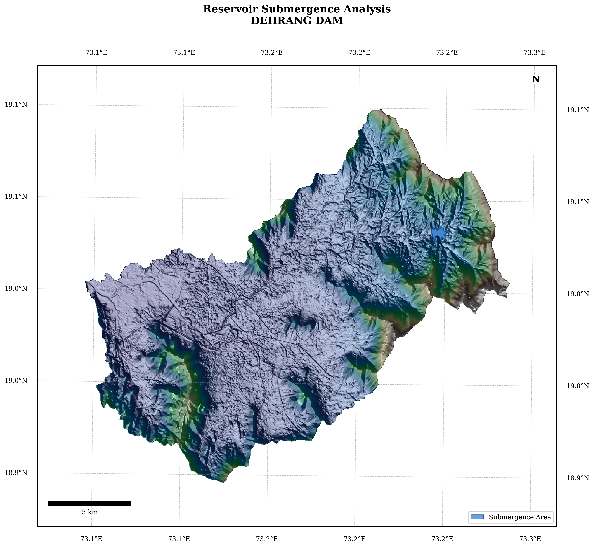
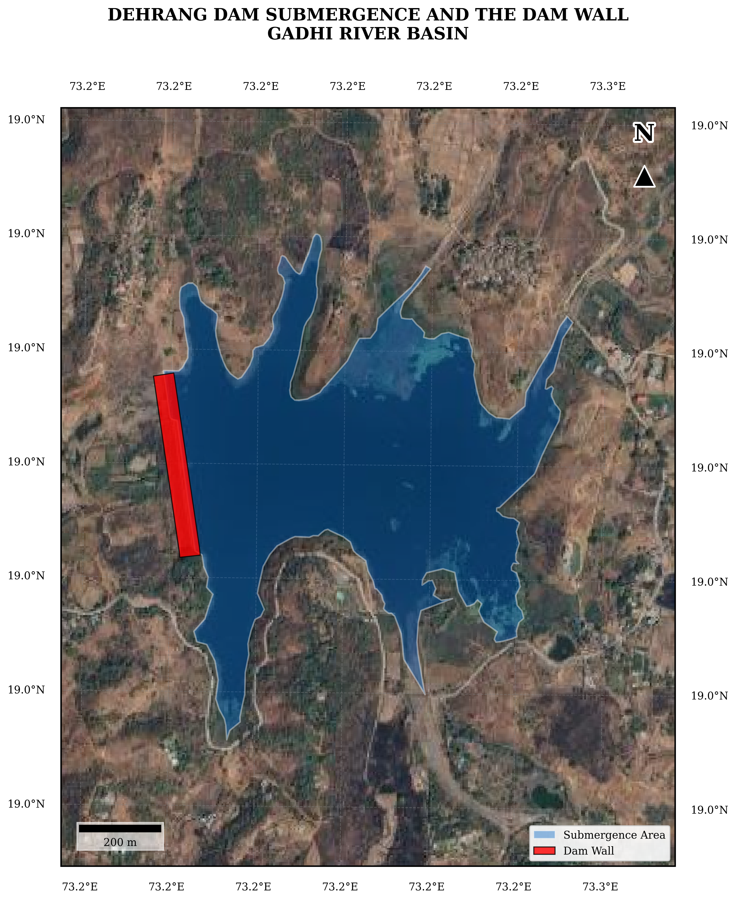

# Chapter 1: Storage-Elevation Analysis

This section of the analysis focuses on determining the storage capacity and elevation relationships for the Dehrang Dam. It processes survey data to calculate the capacity loss due to siltation over time.

## 1. Dam and Project Background

**Dehrang Dam** is a minor earthen dam with an automatic gated spillway located at 19°1′54″N, 73°14′32″E in Raigad District, Maharashtra, commissioned in 1957 and operated by the Panvel Municipal Corporation. The dam stores water in the Gadhi River basin, which drains to the coastal lowlands south of Mumbai.

A Pre-monsoon 2025 inspection was carried out by Yash Engineering Consultant Pvt. Ltd. (Navi Mumbai) using the 10×10 m box method sludge survey, covering 3,193 grid boxes and measuring a total silt accumulation of 517,705.69 m³.

## 2. Storage-Elevation Analysis (Notebook 01)

### 2.1 Survey Data Processing
Each survey box records the bottom and top elevation of the sludge layer and the horizontal plan area of that box. The bottom elevation represents the original reservoir bed; the top elevation represents the current silt surface.

### 2.2 Area-Elevation Relationship
For each elevation h (0.2 m intervals from river bed to FRL):
- **Original area** = sum of plan areas of all boxes whose `Avg_Sludge_Bot ≤ h`
- **Current area** = sum of plan areas of all boxes whose `Avg_Sludge_Top ≤ h`

Above the maximum surveyed elevation, original area is extrapolated using a 2nd-order polynomial fitted to the survey data in the range 83.0–max_surveyed m. Current area above the maximum silt-top elevation is set equal to the original area (no silt recorded above that level).

### 2.3 Volume Integration
Cumulative storage is integrated using the trapezoidal rule:

```
V(i) = V(i-1) + (A(i-1) + A(i)) / 2 × Δh
```

where Δh = 0.2 m and A(i) is the water-spread area at elevation i.

### 2.4 Capacity Loss
Capacity loss at each elevation = Original cumulative volume − Current cumulative volume.

### Visualizations





## Source Code
The complete implementation and outputs are available in the repository:
[View the full Jupyter Notebook for this chapter on GitHub](https://github.com/007-Wik/Dehrang-Dam-breach-Analysis_Panvel/blob/main/docs/notebooks/01_Storage_Elevation_Analysis.ipynb)
