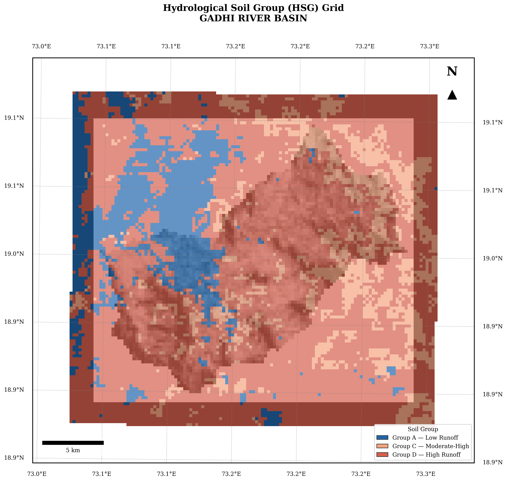
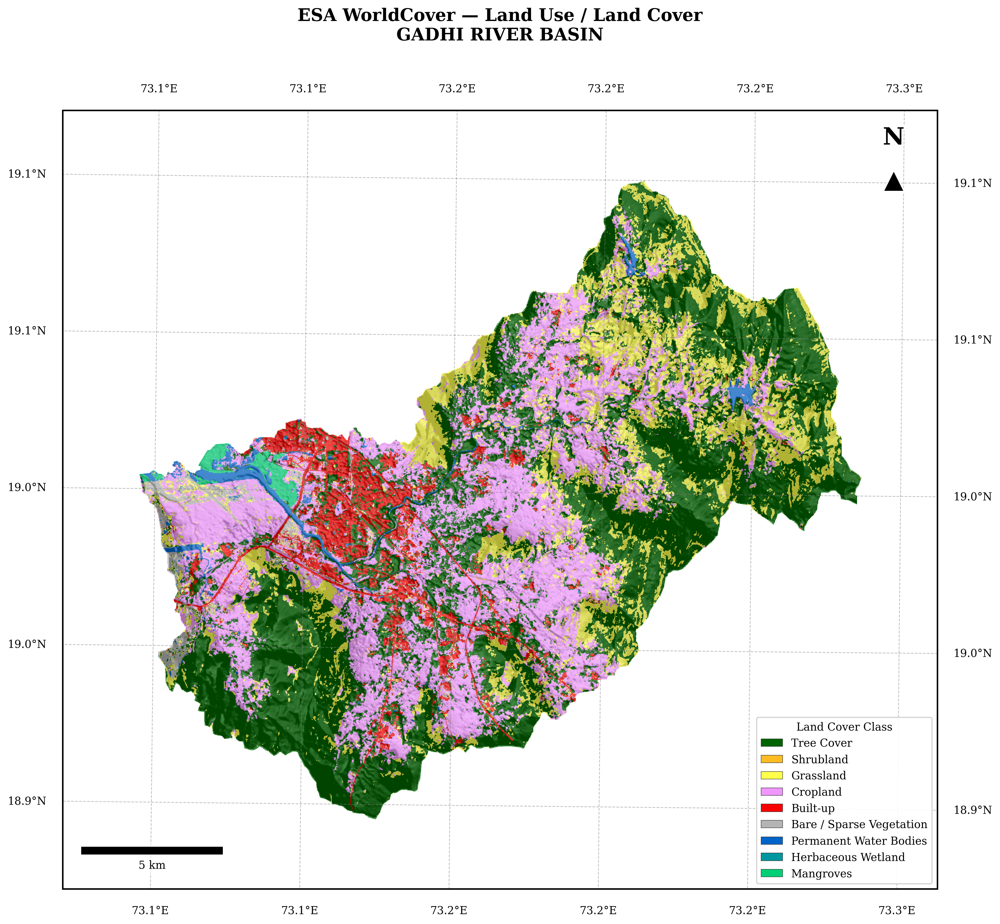
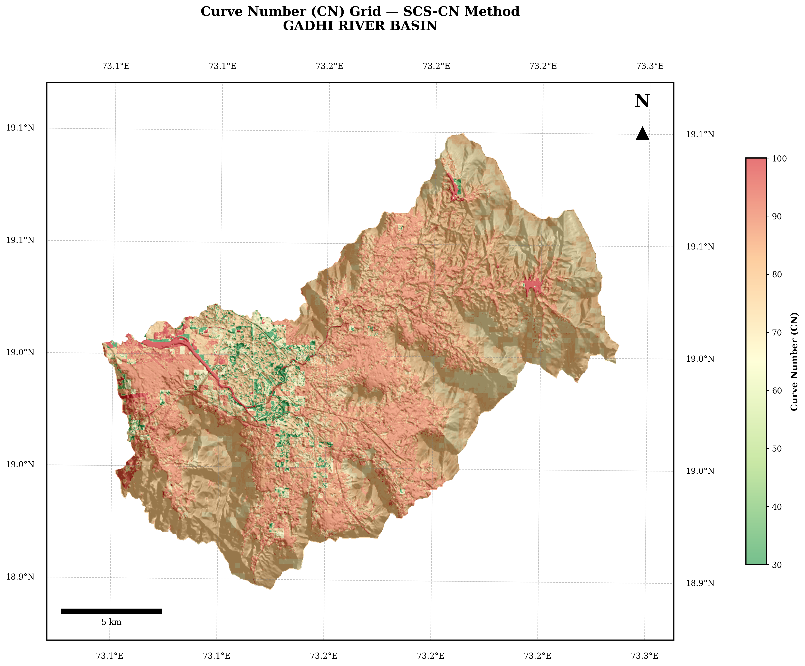
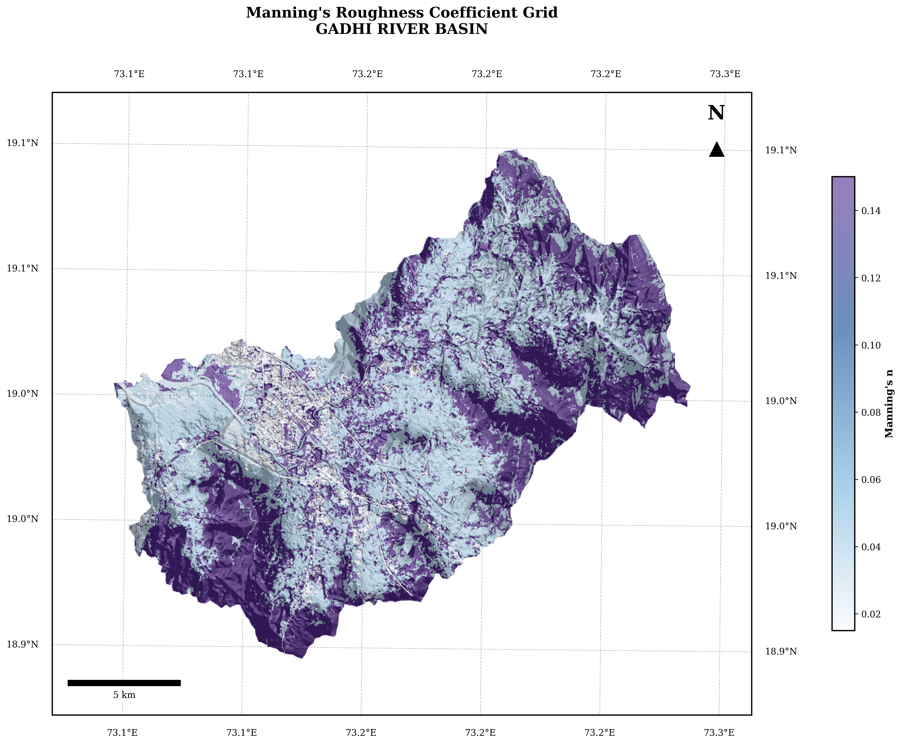

# Chapter 2: Basin Hydrological Preparation

This chapter prepares the necessary spatial and hydrological datasets for the dam break analysis. 

## 3. Hydrological Soil Group Classification (Notebooks 02, 03)

### 3.1 Soil Texture Data
Clay, sand, and silt fractions (g/kg) are downloaded at three depths (0–5 cm, 5–15 cm, 15–30 cm) from ISRIC SoilGrids v2 via the OGC WCS 2.0 API. Values are converted from stored integers (g/kg × 10) to percentages by dividing by 10. A depth-weighted composite is formed:

```
texture_0_30cm = (texture_0_5cm × 5 + texture_5_15cm × 10 + texture_15_30cm × 15) / 30
```

### 3.2 HSG Assignment
Each pixel is classified into USDA Hydrological Soil Group using the textural triangle:
- **Group A** (Low runoff potential): sand, loamy sand, sandy loam
- **Group B** (Moderate-low): silt loam, loam
- **Group C** (Moderate-high): sandy clay loam
- **Group D** (High runoff potential): clay loam, silty clay loam, sandy clay, silty clay, clay



## 4. SCS Curve Number Grid (Notebooks 02, 03)

Curve Numbers are assigned per the NRCS TR-55 (AMC II conditions) lookup table, adapted for Indian conditions per Mishra & Singh (2003). The CN for each pixel is determined by its combination of:
- LULC class (from ESA WorldCover 2021)
- HSG (A, B, C, or D)




## 5. Manning's Roughness Grid (Notebooks 02, 03)

Manning's n values are assigned per LULC class using:
- Open water, impervious surfaces: Chow (1959) channel values
- Forest, cropland, grassland: CWPRS (2018) and Arora et al. (2021) overland flow values



## Source Code
The complete implementation and spatial processing scripts are available in the repository:
[View the full Jupyter Notebook for this chapter on GitHub](https://github.com/007-Wik/Dehrang-Dam-breach-Analysis_Panvel/blob/main/docs/notebooks/02_DBA_Basin_HydroPrep.ipynb)
