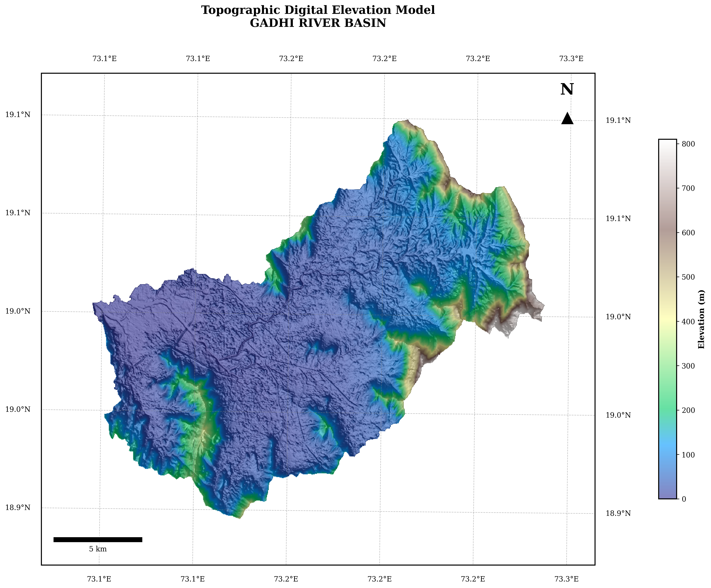

# Chapter 3: Dam Break Analysis and Watershed Delineation

This chapter models the actual dam breach scenario and calculates the downstream flood routing.

## 6. Watershed Delineation (Notebook 03)

### 6.1 DEM Pre-processing
1. Fill pits (single-cell depressions)
2. Fill depressions (multi-cell flat areas)
3. Resolve flats (assign drainage direction through flat areas)

### 6.2 D8 Flow Routing
Flow direction is computed using the D8 algorithm (eight-directional steepest descent). ESRI/HydroSHEDS direction codes: 64, 128, 1, 2, 4, 8, 16, 32.

### 6.3 Pour Point Snapping
Pour points are snapped to the nearest high-accumulation cell (accumulation threshold = 300 cells by default) within a configurable search radius.

### 6.4 Catchment Delineation
The catchment is delineated upstream of the snapped pour point and converted to a polygon using rasterio's polygonise function. Area is computed by reprojecting to UTM Zone 43N (EPSG:32643).

## Source Code
The complete implementation and outputs are available in the repository:
[View the full Jupyter Notebook for this chapter on GitHub](https://github.com/007-Wik/Dehrang-Dam-breach-Analysis_Panvel/blob/main/docs/notebooks/03_DamBreak_Analysis.ipynb)
