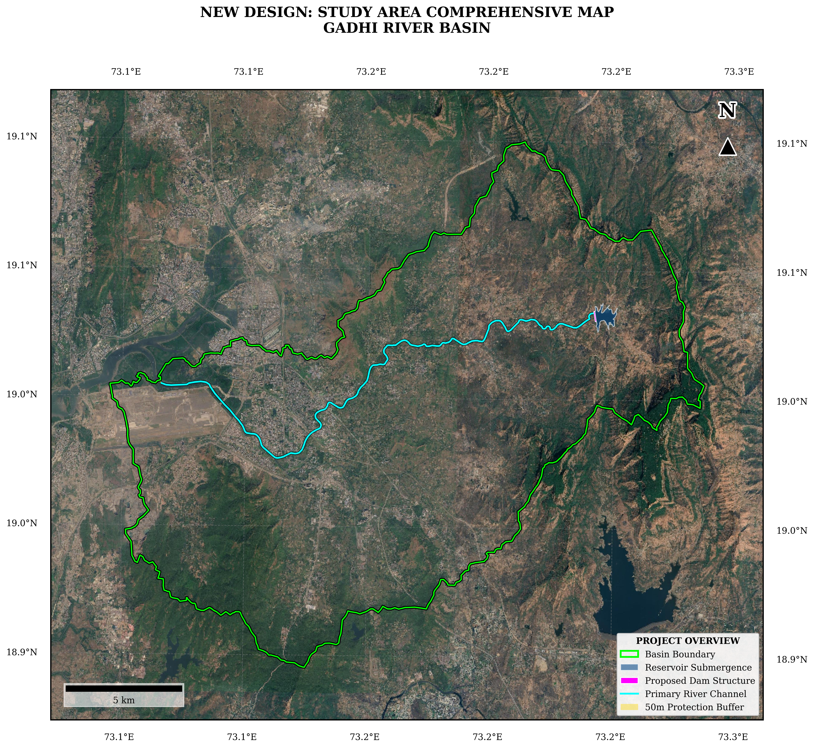

# Chapter 5: Cartographic Maps and Visualization

This final chapter focuses on creating high-quality, professional cartographic maps of the study area, hazard zones, and flood extents.

## 8. Cartographic Maps (Notebook 05)

All maps use:
- **Projection**: UTM (EPSG auto-detected from input rasters)
- **Hillshade**: Computed from Copernicus DEM 30 m using matplotlib `LightSource` (azimuth 315°, altitude 60°, z-factor 1.0)
- **Grid**: Decimal degree gridlines at 0.1° intervals via cartopy `gridlines`
- **North arrow**: Text 'N' + triangle marker at axes upper-right
- **Scale bar**: `matplotlib_scalebar` at lower-left
- **Resolution**: 300 DPI, white background, `bbox_inches='tight'`

## Source Code
The complete implementation for rendering these maps is available in the repository:
[View the full Jupyter Notebook for this chapter on GitHub](https://github.com/007-Wik/Dehrang-Dam-breach-Analysis_Panvel/blob/main/docs/notebooks/05_Maps_GoogleColab.ipynb)
